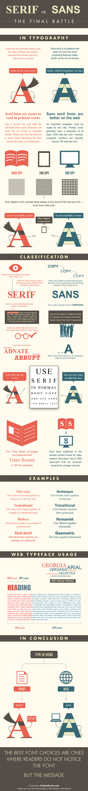

# Introduction to Fonts

As you know by now, the font you choose to display content with, regardless of whether this is for the web, a book, or advertisement, can have great effects on the reception of that content.

Sometimes a font is chosen simply in order to be clear, and sometimes it is part of an entire branding strategy. Regardless the reason, it is important to understand how fonts are selected and applied for websites, as well as how the clients computer actually displays them.

# Font Types

There are three general types of fonts that can be used in basic classification.

- <p style="font-family: serif; font-size:2em;">serif</p>
- <p style="font-family: sans-serif;font-size:2em;">sans-serif</p>
- <p style="font-family: monospace;font-size:2em;">monospace</p>

By an large, you will make your choice between types of serif and sans-serif fonts for the presentation of content.

The following infographic from [Urbanfonts.com](http://www.urbanfonts.com/blog/2013/02/serif-vs-sans-the-final-battle/) provides a nice breakdown of their differences.



<br />
<br />

#### { TODO: }

Please also read the following on serif vs sans-serif fonts;

- ["The Difference Between Serif And Sans Serif", visual hierarchy](https://visualhierarchy.co/blog/serif-vs-sans-serif/)
- ["Serif vs. Sans for Text in Print", fonts.com](https://www.fonts.com/content/learning/fontology/level-1/type-anatomy/serif-vs-sans-for-text-in-print)

<br />

One thing you will notice from these various resources is a general guidance to use "serif" fonts for print, and "sans-serif" fonts for displays. Honestly, as displays continue to become better, and strain the eyes less in general, the rule of thumb no longer holds true.


### Examples of Serif Sites

There are many examples of sites using "serif" fonts to great effect. Look at articles from;

- [New York Times](http://www.nytimes.com/2013/01/07/arts/design/what-constitutes-good-and-bad-web-design.html)
- [The New Yorker](http://www.newyorker.com/culture/culture-desk/celebrating-design-without-contending-with-it)

As well as this article on the use of serif fonts in web design.

- [21 Stunning Serif Fonts for the Modern Website](http://www.dtelepathy.com/blog/design/21-stunning-serif-fonts-websites)


### Examples of Sans-Serif Sites

Likewise, there are many examples of websites using sans-serif fonts to great effect;

- [MoMA Blog](https://www.moma.org/explore/inside_out/2010/02/19/a-few-words-with-yugo-nakamura/)
- [Huffington Post](http://www.huffingtonpost.com/quora/-what-are-the-most-common_b_13772694.html)
- [The Whitney](http://whitney.org/About/NewBuilding)


# Heading/Body Combination

One common design choice is to pair a serif font for headings with a sans-serif body font (or vice-versus).

This has the effect of visually driving the eye, or making it easier for a reader to visually differentiate sections.

#### { TODO: }

Read:

- ["Font Pairings: 20 Perfect Examples"](http://www.creativebloq.com/typography/20-perfect-type-pairings-3132120)

Explore these additional font combinations:

- [Font Pair](http://fontpair.co/)


# Monospace Fonts

Most modern fonts that are used for computers utilize "proportional width". This means a character is only as wide as necessary.

Alternatively there is a class of fonts known as "fixed-width" or "monospaced". Each character in a monospaced font family is the same number of pixels wide.

These fonts are still used, although they are primarily utilized in for code. As an example, the code blocks throughout this courses webpages use the "Fira Mono" fixed width font.

One of the primary reasons for using these fonts is that characters will align vertically between different lines.

```bash
This line is 32 characters long.
I also take up 32 characters ...

We can have different phrases- :)
But the characters will align- :)
------------------------------ :)
                               :)
```

Since using a monospaced font essentially creates a grid system. Many hackers, and 90's teenagers have utilized monospaces fonts to create "ASCII Text Art".

```bash
------------Oooo---
-----------(----)---
------------)--/----
------------(_/-
----oooO----
----(---)----
-----\--(--
------\_)-
-----------Oooo---
-----------(----)---
------------)--/----
------------(_/-
----oooO----
----(---)----
-----\--(--
------\_)-
```

```text
__  __           _      _
|  \/  |         (_)    | |
| \  / |_   _ ___ _  ___| | __
| |\/| | | | / __| |/ __| |/ /
| |  | | |_| \__ \ | (__|   <
|_|  |_|\__,_|___/_|\___|_|\_\

.----------------.  .----------------.  .----------------.  .----------------.  .----------------.  .----------------.
| .--------------. || .--------------. || .--------------. || .--------------. || .--------------. || .--------------. |
| | ____    ____ | || | _____  _____ | || |    _______   | || |     _____    | || |     ______   | || |  ___  ____   | |
| ||_   \  /   _|| || ||_   _||_   _|| || |   /  ___  |  | || |    |_   _|   | || |   .' ___  |  | || | |_  ||_  _|  | |
| |  |   \/   |  | || |  | |    | |  | || |  |  (__ \_|  | || |      | |     | || |  / .'   \_|  | || |   | |_/ /    | |
| |  | |\  /| |  | || |  | '    ' |  | || |   '.___`-.   | || |      | |     | || |  | |         | || |   |  __'.    | |
| | _| |_\/_| |_ | || |   \ `--' /   | || |  |`\____) |  | || |     _| |_    | || |  \ `.___.'\  | || |  _| |  \ \_  | |
| ||_____||_____|| || |    `.__.'    | || |  |_______.'  | || |    |_____|   | || |   `._____.'  | || | |____||____| | |
| |              | || |              | || |              | || |              | || |              | || |              | |
| '--------------' || '--------------' || '--------------' || '--------------' || '--------------' || '--------------' |
'----------------'  '----------------'  '----------------'  '----------------'  '----------------'  '----------------'


MMMMMMMM               MMMMMMMM                                     iiii                      kkkkkkkk
M:::::::M             M:::::::M                                    i::::i                     k::::::k
M::::::::M           M::::::::M                                     iiii                      k::::::k
M:::::::::M         M:::::::::M                                                               k::::::k
M::::::::::M       M::::::::::Muuuuuu    uuuuuu      ssssssssss   iiiiiii     cccccccccccccccc k:::::k    kkkkkkk
M:::::::::::M     M:::::::::::Mu::::u    u::::u    ss::::::::::s  i:::::i   cc:::::::::::::::c k:::::k   k:::::k
M:::::::M::::M   M::::M:::::::Mu::::u    u::::u  ss:::::::::::::s  i::::i  c:::::::::::::::::c k:::::k  k:::::k
M::::::M M::::M M::::M M::::::Mu::::u    u::::u  s::::::ssss:::::s i::::i c:::::::cccccc:::::c k:::::k k:::::k
M::::::M  M::::M::::M  M::::::Mu::::u    u::::u   s:::::s  ssssss  i::::i c::::::c     ccccccc k::::::k:::::k
M::::::M   M:::::::M   M::::::Mu::::u    u::::u     s::::::s       i::::i c:::::c              k:::::::::::k
M::::::M    M:::::M    M::::::Mu::::u    u::::u        s::::::s    i::::i c:::::c              k:::::::::::k
M::::::M     MMMMM     M::::::Mu:::::uuuu:::::u  ssssss   s:::::s  i::::i c::::::c     ccccccc k::::::k:::::k
M::::::M               M::::::Mu:::::::::::::::uus:::::ssss::::::si::::::ic:::::::cccccc:::::ck::::::k k:::::k
M::::::M               M::::::M u:::::::::::::::us::::::::::::::s i::::::i c:::::::::::::::::ck::::::k  k:::::k
M::::::M               M::::::M  uu::::::::uu:::u s:::::::::::ss  i::::::i  cc:::::::::::::::ck::::::k   k:::::k
MMMMMMMM               MMMMMMMM    uuuuuuuu  uuuu  sssssssssss    iiiiiiii    cccccccccccccccckkkkkkkk    kkkkkkk

███╗   ███╗██╗   ██╗███████╗██╗ ██████╗██╗  ██╗
████╗ ████║██║   ██║██╔════╝██║██╔════╝██║ ██╔╝
██╔████╔██║██║   ██║███████╗██║██║     █████╔╝
██║╚██╔╝██║██║   ██║╚════██║██║██║     ██╔═██╗
██║ ╚═╝ ██║╚██████╔╝███████║██║╚██████╗██║  ██╗
╚═╝     ╚═╝ ╚═════╝ ╚══════╝╚═╝ ╚═════╝╚═╝  ╚═╝

.   ,               ,
|\ /|         o     |
| V | . . ,-. . ,-. | ,
|   | | | `-. | |   |<
'   ' `-` `-' ' `-' ' `
```

```text
___________________▄▄▄▀▀▀▀▀▀▀▄
 _______________▄▀▀____▀▀▀▀▄____█
 ___________▄▀▀__▀▀▀▀▀▀▄___▀▄___█
 __________█▄▄▄▄▄▄_______▀▄__▀▄__█
 _________█_________▀▄______█____█_█
 ______▄█_____________▀▄_____▐___▐_▌
 ______██_______________▀▄___▐_▄▀▀▀▄
 ______█________██_______▌__▐▄▀______█
 ______█_________█_______▌__▐▐________▐
 _____▐__________▌_____▄▀▀▀__▌_______▐_____________▄▄▄▄▄▄
 ______▌__________▀▀▀▀________▀▀▄▄▄▀______▄▄████▓▓▓▓▓▓▓███▄
 ______▌____________________________▄▀__▄▄█▓▓▓▓▓▓▓▓▓▓▓▓▓▓▓▓▓▄
 ______▐__________________________▄▀_▄█▓▓▓▓▓▓▓▓▓▓_____▓▓____▓▓█▄
 _______▌______________________▄▀_▄█▓▓▓▓▓▓▓▓▓▓▓____▓▓_▓▓_▓▓__▓▓█
 _____▄▀▄_________________▄▀▀▌██▓▓▓▓▓▓▓▓▓▓▓▓▓__▓▓▓___▓▓_▓▓__▓▓█
 ____▌____▀▀▀▄▄▄▄▄▄▄▄▀▀___▌█▓▓▓▓▓▓▓▓▓▓▓▓▓▓▓__▓________▓▓___▓▓▓█
 _____▀▄_________________▄▀▀▓▓▓▓▓▓▓▓█████████████▄▄_____▓▓__▓▓▓█
 _______█▓▓▓▓▓▓▓▓▓▓▓▓▓▓▓█▓▓▓▓▓██▓▓▓▓▓▓▓▓▓▓▓▓▓▓▓██▄▄___▓▓▓▓▓█
 _______█▓▓▓▓▓▓▓▓▓▓▓▓▓▓▓█▓▓███▓▓▓▓████▓▓▓▓▓▓▓▓▓▓▓▓▓██▓▓▓▓▓▓█
 ________█▓▓▓▓▓▓▓▓▓▓▓▓▓▓█▓█▓▓██░░███████░██▓▓▓▓▓▓▓▓▓▓██▓▓▓▓▓█
 ________█▓▓▓▓▓▓▓▓▓▓▓▓▓▓██▓░░░░░█░░░░░██░░░░██▓▓▓▓▓▓▓▓▓██▓▓▓▓▌
 ________█▓▓▓▓▓▓▓▓▓▓▓▓▓▓███░░░░░░░░____░██░░░░░░░██▓▓▓▓▓▓▓██▓▓▌
 ________▐▓▓▓▓▓▓▓▓▓▓▓▓▓▓██░░░░░░░________░░░░░░░░░██████▓▓▓▓▓█▓▌
 ________▐▓▓▓▓▓▓▓▓▓▓▓▓▓▓██░░░░░░___▓▓▓▓▓░░░░░░░███░░███▓▓▓▓▓█▓▌
 _________█▓▓▓▓▓▓▓▓▓▓▓▓▓██░░░░░___▓▓█▄▄▓░░░░░░░░___░░░░█▓▓▓▓▓█▓▌
 _________█▓▓▓▓▓▓▓▓▓▓▓▓▓█░░█░░░___▓▓██░░░░░░░░▓▓▓▓__░░░░█▓▓▓▓██
 _________█▓▓▓▓▓▓▓▓▓▓▓▓▓█░███░░____▓░░░░░░░░░░░█▄█▓__░░░░█▓▓█▓█
 _________▐▓▓▓▓▓▓▓▓▓▓▓▓▓█░█████░░░░░░░░░░░░░░░░░█▓__░░░░███▓█
 __________█▓▓▓▓▓▓▓▓▓▓▓▓█░░███████░░░░░░░░░░░░░░░▓_░░░░░██▓█
 __________█▓▓▓▓▓▓▓▓▓▓▓▓█░░░███████░░░░░░░░░░░░░░_░░░░░██▓█
 __________█▓▓▓▓▓▓▓▓▓▓▓▓█░░░███████░░░░░░░░░░░░░░░░░░░██▓█
 ___________█▓▓▓▓▓▓▓▓▓▓▓▓█░░░░███████░░░░░░░░░░░█████░██░░░
 ___________█▓▓▓▓▓▓▓▓▓▓▓▓█░░░░░░__███████░░░░░███████░░█░░░░
 ___________█▓▓▓▓▓▓▓▓▓▓▓▓▓█░░░░░░█▄▄▄▀▀▀▀████████████░░█░░░░
 ___________▐▓▓▓▓▓▓▓▓▓▓▓▓█░░░░░░██████▄__▀▀░░░███░░░░░█░░░
 ___________▐▓▓▓▓▓▓▓▓▓▓▓█▒█░░░░░░▓▓▓▓▓███▄░░░░░░░░░░░░░░░______▄▄▄
 ___________█▓▓▓▓▓▓▓▓▓█▒▒▒▒█░░░░░░▓▓▓▓▓█░░░░░░░░░░░░░░░▄▄▄_▄▀▀____▀▄
 __________█▓▓▓▓▓▓▓▓▓█▒▒▒▒█▓▓░░░░░░░░░░░░░░░░░░░░░____▄▀____▀▄_________▀▄
 _________█▓▓▓▓▓▓▓▓▓█▒▒▒▒█▓▓▓▓░░░░░░░░░░░░░░░░░______▐▄________█▄▄▀▀▀▄__█
 ________█▓▓▓▓▓▓▓▓█▒▒▒▒▒▒█▓▓▓▓▓▓▓░░░░░░░░░____________█_█______▐_________▀▄▌
 _______█▓▓▓▓▓▓▓▓█▒▒▒▒▒▒███▓▓▓▓▓▓▓▓▓▓▓█▒▒▄___________█__▀▄____█____▄▄▄____▐
 ______█▓▓▓▓▓▓▓█_______▒▒█▒▒██▓▓▓▓▓▓▓▓▓▓█▒▒▒▄_________█____▀▀█▀▄▀▀▀___▀▀▄▄▐
 _____█▓▓▓▓▓██▒_________▒█▒▒▒▒▒███▓▓▓▓▓▓█▒▒▒██________▐_______▀█_____________█
 ____█▓▓████▒█▒_________▒█▒▒▒▒▒▒▒▒███████▒▒▒▒██_______█_______▐______▄▄▄_____█
 __█▒██▒▒▒▒▒▒█▒▒____▒▒▒█▒▒▒▒▒▒▒▒▒▒▒▒▒▒█▒____▒█▓█__▄█__█______▀▄▄▀▀____▀▀▄▄█
 __█▒▒▒▒▒▒▒▒▒▒█▒▒▒████▒▒▒▒▒▒▒▒▒▒▒▒▒▒▒█_______█▓▓█▓▓▌_▐________▐____________▐
 __█▒▒▒▒▒▒▒▒▒▒▒███▒▒▒▒▒▒▒▒▒▒▒▒▒▒▒▒▒▒█▒_______█▓▓▓█▓▌__▌_______▐_____▄▄____▐
 _█▒▒▒▒▒▒▒▒▒▒▒▒▒▒▒▒▒▒▒▒▒▒▒▒▒▒▒▒▒▒▒▒▒█▒▒_____█▓▓▓█▓▓▌__▌_______▀▄▄▀______▐
 _█▒▒▒▒▒▒▒▒▒▒▒▒▒▒▒▒▒▒▒▒▒▒▒▒▒▒▒▒▒▒▒▒▒▒███████▓▓█▓▓▓▌__▀▄_______________▄▀
 _█▒▒▒▒▒▒▒▒▒▒▒▒▒▒▒▒▒▒▒▒▒▒▒▒▒▒▒▒▒▒▒███▒▒▒▒▒▒▒██▓▓▓▓▓▌___▀▄_________▄▀▀
 █▒▒▒▒▒▒▒▒▒▒▒▒▒▒▒▒▒▒▒▒▒▒▒▒▒▒▒▒▒██▒▒▒▒▒▒▒▒▒▒▒▒▒█▓▓▓▓▓▀▄__▀▄▄█▀▀▀
 █▒▒▒▒▒▒▒▒▒▒▒▒▒▒▒▒▒▒▒▒▒▒▒▒▒▒▒▒█▒▒▒▒▒▒▒▒▒▒▒▒▒▒▒▒██▓▓▓▓██▄▄▄▀
 █▒▒▒▒▒▒▒▒▒▒▒▒▒▒▒▒▒▒▒▒▒▒▒▒▒▒▒█▒▒▒▒▒▒▒▒▒▒▒▒▒▒▒▒▒▒▒████
 █▒▒▒▒▒▒▒▒▒▒▒▒▒▒▒▒▒▒▒▒▒▒▒▒▒▒█▒▒▒▒▒▒▒▒▒▒▒▒▒▒▒▒▒▒▒▒▒█
 _█▒▒▒▒▒▒▒▒▒▒▒▒▒▒▒▒▒▒▒▒▒▒▒▒▒█▒▒▒█▒▒▒▒▒▒▒▒▒▒▒▒▒▒▒▒▒▒█▄▄▄▄▄
 _█▒▒▒▒▒▒▒▒▒▒▒▒▒▒▒▒▒▒▒▒▒▒▒▒█▒▒▒▒█▒▒▒▒▒▒▒▒▒▒▒▒▒▒▒███▒▒▒▒▒▒██▄▄
 __█▒▒▒▒▒▒▒▒▒▒▒▒▒▒▒▒▒▒▒▒▒▒▒█▒▒▒▒█▒▒▒▒▒▒▒▒▒▒▒▒███▒▒▒▒▒▒▒▒▒▒▒▒▒█▄
 __█▒▒▒▒▒▒▒▒▒▒▒▒▒▒▒▒▒▒▒▒▒▒▒█▒▒▒▒█▒▒▒▒▒▒▒▒▒▒▒█▒▒▒▒▒▒▒▒▒▒▒▒▒▒▒▒▒▒█
 __█▒▒▒▒▒▒▒▒▒▒▒▒▒▒▒▒▒▒▒▒▒▒▒█▒▒▒▒█▒▒▒▒▒▒▒▒▒██▒▒▒▒▒▒▒▒▒▒▒▒▒▒▒▒▒▒▒▒█
 ___█▒▒▒▒▒▒▒▒▒▒▒▒▒▒▒▒▒▒▒▒▒▒█▒▒▒▒█▒▒▒▒▒▒▒▒█▒▒▒▒▒▒▒▒▒▒▒▒▒░░░░▒▒▒▒▒▒▌
 ____█▒▒▒▒▒▒▒▒▒▒▒▒▒██▒▒▒▒▒▒▒█▒▒▒▒█▒▒▒▒▒▒█▒▒▒▒▒▒▒▒▒░░░░░░░░░░░░░▒▒▌
 ____█▒▒▒▒▒▒▒▒▒▒▒▒▒▒▒█████████████▒▒▒▒▒█▒▒▒▒▒▒▒▒░░░░▒▒▒▒▒▒▒▒▒▒▒░▒▌
 _____█▒▒▒▒▒▒▒▒▒▒▒▒▒▒▒▒▒▒▒▒█_______▐▒▒▒▒█▒▒▒▒▒▒▒░░░▒▒▒▒▒▒▒▒▒▒▒▒▒▒▒░▌
 ______█▒▒▒▒▒▒▒▒▒▒▒▒▒▒▒▒▒▒▒█________█▒▒█▒▒▒▒▒▒░░░▒▒▒▒▒▒▒▒▒▒▒▒▒▒▒▒▒▒▌
 _______█▒▒▒▒▒▒▒▒▒▒▒▒▒▒▒▒▒▒█________█▒█▒▒▒▒▒▒░░░▒▒▒▒▒▒▒▒▒▒▒▒▒▒▒▒▒▒▒▌
 ________█▒▒▒▒▒▒▒▒▒▒▒▒▒▒▒▒▒▒█________█▒▒▒▒▒▒░░▒▒▒▒▒▒▒▒▒▒▒▒▒▒▒▒▒▒▒▒█
 _________█▒▒▒▒▒▒▒▒▒▒▒▒▒▒▒▒▒▒█________█▒▒▒▒░░▒▒▒▒▒▒▒▒▒▒▒▒▒▒▒▒▒▒▒▒█
 _________█▒▒▒▒▒▒▒▒▒▒▒▒▒▒▒▒▒▒█________█▒▒▒░░░░░░░▒▒▒▒▒▒▒▒▒▒▒▒▒▒█▀
 __________█▒▒▒▒▒▒▒▒▒▒▒▒▒▒▒▒▒▒█_______█▒░░░▒▒▒▒▒░░░░░░░░▒▒▒█▀▀▀
 ___________█▒▒▒▒▒▒▒▒▒▒▒▒▒▒▒▒▒▒█_______█░▒▒▒▒▒▒▒▒▒▒▒▒▒░░░░█▀
 ____________█▒▒▒▒▒▒▒▒▒▒▒▒▒▒▒▒▒▒█_______█▒▒▒▒▒▒▒▒▒▒▒▒▒▒▒█▀
 _____________█▒▒▒▒▒▒▒▒▒▒▒▒▒▒▒▒▒▒█_______█▒▒▒▒▒▒▒▒▒▒▒▒█▀
 _____________█▒▒▒▒▒▒▒▒▒▒▒▒▒▒▒▒▒▒▒█_______▀▀▀███████▀▀
 ______________█▒▒▒▒▒▒▒▒▒▒▒▒▒▒▒▒▒▒▒█
 _______________█▒▒▒▒▒▒▒▒▒▒▒▒▒▒▒▒▒▒▒█
 ________________█▒▒▒▒▒▒▒▒▒▒▒▒▒▒▒▒▒▒▒█
 _________________█▒▒▒▒▒▒▒▒▒▒▒▒▒▒▒▒▒▒▒█
 __________________█▒▒▒▒▒▒▒▒▒▒▒▒▒▒▒▒██▒█
 ___________________█▒▒▒▒▒▒▒▒▒▒▒▒▒██▒▒▒▒█
 ___________________█▒▒▒▒▒▒▒▒████▒▒▒▒▒▒▒█
 ___________________█████████▒▒▒▒▒▒▒▒▒▒▒█
 ____________________█▒▒▒▒▒▒▒▒▒▒▒▒▒▒▒▒▒▒▒█
 ____________________█▒▒▒▒▒▒▒▒▒▒▒▒▒▒▒▒▒▒▒█
 _____________________█▒▒▒▒▒▒▒▒▒▒▒▒▒▒▒▒▒▒░▌
 _____________________█▒▒▒▒▒▒▒▒▒▒▒▒▒▒▒▒▒▒░▌
 ______________________█▒▒▒▒▒▒▒▒▒▒▒▒▒▒▒▒░░▌
 _______________________█▒▒▒▒▒▒▒▒▒▒▒▒▒▒░░█
 ________________________█▒▒▒▒▒▒▒▒▒▒▒░░░█
 __________________________██▒▒▒▒▒▒░░░█▀
 _____________________________█░░░░░█▀
 _______________________________▀▀▀▀
```

The following site helps translate any phrase to text art.

- [Phrase to Text Art](http://patorjk.com/software/taag/#p=testall&f=Doh&t=Musick)
