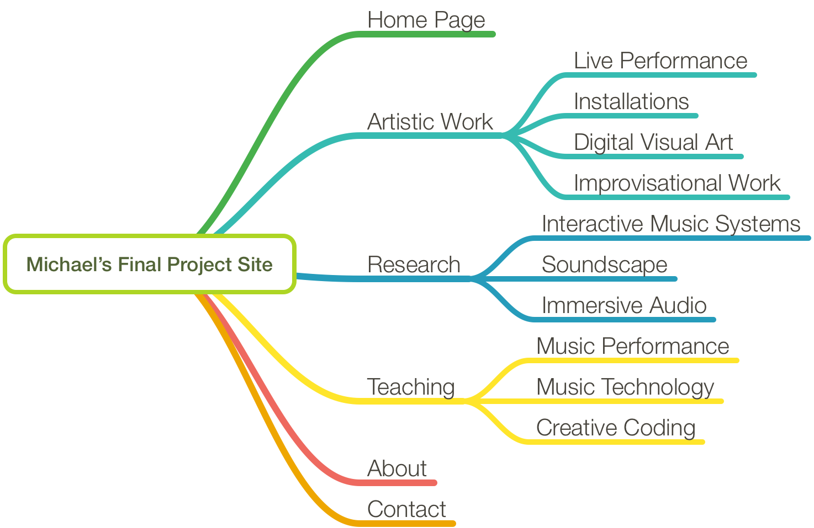

# Site Map

After developing your content, you should start to build a site map. This is a tree-like structure that outlines each page, along with sub-pages, or the major content on each page. Below is an example of a site map I might make for a personal website.

## Required Pages or Portions

You are required to have at least the following sections within your final site. These could be as individual pages, or could be joined together with other content if appropriate.

- Homepage
    - A main page, that is engaging and draws the users into your content.
    - Additionally, this page should make it perfectly clear, immediatly, what your site is about.
- Contact
    - You can have a separate contact page, or have contact info in another page.
    - This should include a form, that users can fill out, which will send an email to your email account.
    - Use a service like [formspree.io](https://formspree.io) for this.
- About
    - You need an about page or section that discusses what this site is about, or presents information about you.

You will of course have other pages/sections. These will be dictated by the main purpose of your content/site, and how this content needs to be presented. 
