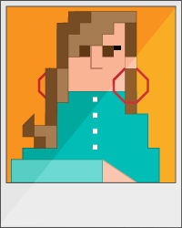

## Your Dev Guides:
▶ &nbsp;▶  &nbsp;▶

We're here to help you on your design and development journey. Don't hesitate to ask questions, schedule a meeting, or simply drop us a line.

<h3>Instructor</h3>

<ul>
<li><b>Instructor:</b> Justine Evans</li>
<li><b>E-mail:</b> <a href="mailto:justine.evans@umontana.edu">justine.evans@umontana.edu</a></li>
<li><b>Online Availability:</b> 10:00AM - 4:00PM, Monday-Thursday*</li>
<li><b>Office Hours:</b> By Appointment  
<i>* Please allow up to 48 hours for e-mail replies. Thank you! </i></li>
</ul>

### Teaching Assistant, Fall 2017
- **TA:** Jeramy Parker
- **E-mail:** [jeramy1.parker@umontana.edu](mailto:jeramy1.parker@umontana.edu)
- **Online Availability:** TBA
- **Office Hours:** TBA

#### Course Originator
- **Thanks to:** Dr. Michael Musick
- **E-mail:** [michael.musick@umontana.edu](mailto:michael.musick@umontana.edu)
