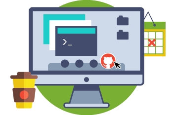

# Topic 01:   Internetting Pt. 1
This topic is all about the internet, what it is, and what it _isn't._ You'll also get a chance to explore the GitHub Issues board and Project panel that we'll be using for this course.

## Introduction to Project 1

<b>Introductory Project: My First Web Page!</b>

Your first project introduces the class and its tools (GitHub), as well as the (in)tangibility of the internet and world wide web.

<i>Duration: 3 Modules/Weeks</i>

The first part of this project will simply be your first interaction with the GitHub repo and Issues board, and sharing your reaction with this Topic's materials.

Project Part 

# Topic Goals
By the end of this Topic, we hope you:

1. Have some idea what the internet is and _is not_, and be able to articulate these opinions.
2. Understand what web development is and _is not_, and keep it in mind going forward.
3. Use the GitHub Issues board to post a reply to a live issue.
