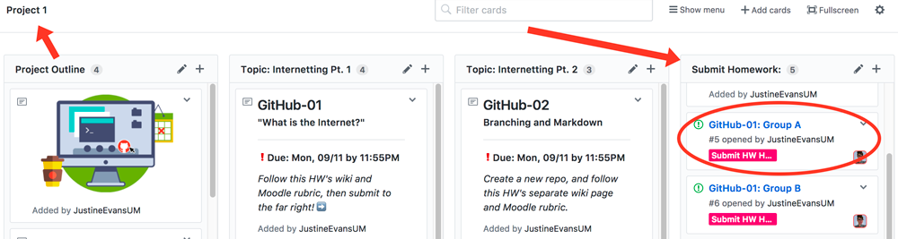
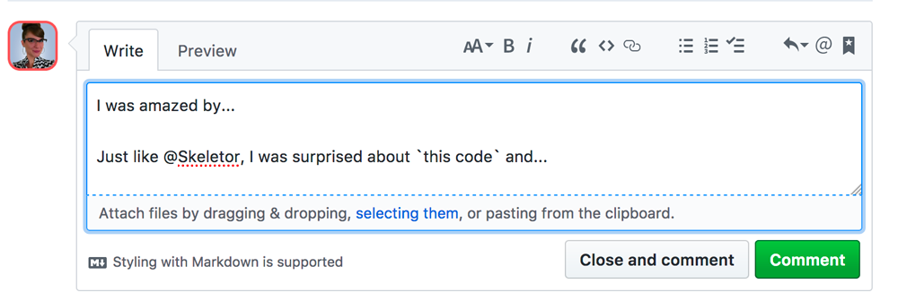
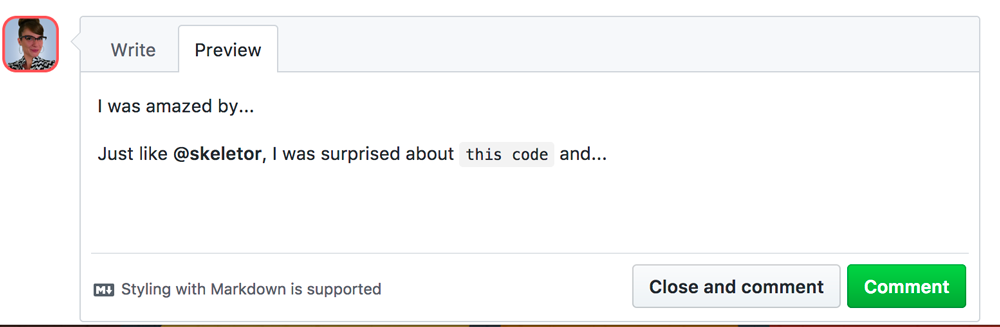

## Using GitHub

To complete the assignment for this topic, you'll need to have registered for a free GitHub account and respond to an “issue” in the class repository.

We will discuss [GitHub.com](github.com) more in the next Topic. In the mean time, I would you like you to know that GitHub is a web service which is used for storing git repositories by developers. (Much of that statement is still likely jargon to you, and that's okay - it will all come in time.)

### Create a GitHub.com Account

First, visit [GitHub.com](https://github.com/) and create a new user account.

**NOTE:** Please choose a username that you are comfortable with being part of your publicly visible URL. For grading purposes, this should be a derivate of your name (make it easy on us please). Your username will be publicly available and used often for many things throughout this course (ie. homework and projects) and your entire time on GitHub. _Examples: JustineEvansMT, JNEvans, J-Evans-Designer, Just-Justine-Evans._

1. Fix any problems the signup engine informs you about.
2. Keep “unlimited public repositories for free” selected. Then select “continue."
3. Go to the e-mail account you used during account creation and verify your e-mail address.
4. After your account is created, select the avatar in the upper-right hand corner. This should produce a dropdown menu. From there select the “settings” option.

5. Fill out your **full name** for us to track for grading purposes.
6. From here feel free to fill in as much or little of the public profile information as you want. Uploading a **profile picture** is encouraged.

### The Issues Board
#### Contributing
1. Go to the course repo either by clicking [this link](https://github.com/Media-Ed-Online/intro-web-dev) or the GitHub octocat logo from the navigation menu above.
2. Make sure you have watched the videos from the previous "Internet" tab.
3. Navigate to your specific group's Issue. You can do this one of two ways:
- Under [Project 1](https://github.com/Media-Ed-Online/intro-web-dev/projects/7), in the "Submit Homework" column.

- By searching the [Issues](https://github.com/Media-Ed-Online/intro-web-dev/issues) directly.

4. Add a comment to the appropriate “GitHub-01: Group #" post, discussing an element of the Internet, web design, and/or web development that was new to you. Share your thoughts from this Topic!

**NOTE:** You should not reply directly to a classmate's comment in this instance. However, if you would like to further a comment already there, “@mention” the classmate/user and continue their discussion.

You can use Markdown in these Issues, and prview it before commenting.

#### Creating
As the semester goes on you will be expected to **open issues** when you are having problems. You will also be graded on your involvement in the course issue board and your responses provided to fellow classmates throughout the semester. You can earn your participation points by:
- Asking questions
- Answering questions
- Sharing resources or helpful insight
- Sharing experiences, challenges, or successes

**NOTE:** You will **only reply** to assignment threads, not create them.

# { TODO: }
- Create a GitHub account, and update your settings.
- You should have added your response/comment to the open issue on the class repo.
