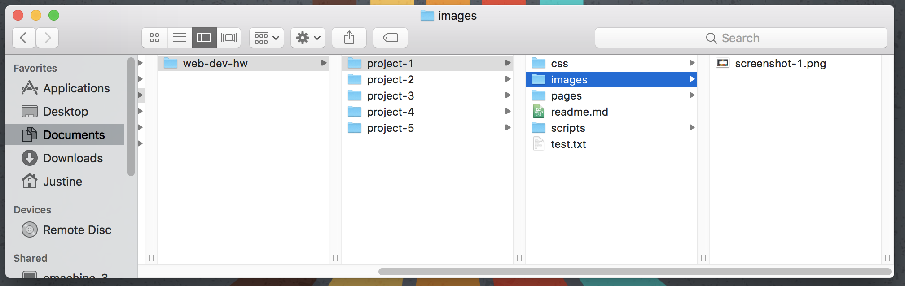

## Markdown & GitHub:

[GitHub.com](https://github.com/) uses markdown extensively within its ecosystem for documentation, readme files, as well as allowing for issues to be written using markdown. You should add a README file to your repository to tell other people why your project is useful, what they can do with your project, and how they can use it.

If you put your README file in your repository's root directory (in our case, "Project-#"), GitHub will recognize and automatically surface your README to repository visitors. Go ahead, [check ours out.](https://github.com/Media-Ed-Online/intro-web-dev)

**For every homework assignment you submit, you will also write a short report in markdown.** This report should discuss a number of things every week:

- Summarize the work you did this homework cycle, paying particular attention to the individual choices you made.
- Did you have any problems or issues? How did you solve these?
- Is there anything in particular you learned that you would like to discuss further?
- Did you post any of your problems to issues to the repo? What issues did you help your fellow classmates out with this past homework cycle?

### Your First README.md
Let's begin by creating your own README.md for Project 1.
1. Create a 'New File' from Atom's File menu.
2. Copy and Paste this line into the blank file: `# My First README.md`
3. Save the file as "README.md" or "readme.md" **only.** This file should live in your `/web-dev-hw/project-1/` repositoty (not any deeper).
4. Preview what the rendered text will look like by opening the command palette and pulling up the ‘markdown preview.'

Start typing “preview” until “Markdown Preview: Toggle” is seen. Select this option by clicking it or pressing return. This will show you the rendered version of the markdown code.

Excellent! Finish this first README by completing the **{TODO:}**

#### Cheatsheets
You should try using a simple markdown cheat sheet, which will tell you what symbols you need to use to specify structure and syntax. A google search will return a number of useful results.  However, I would suggest you start with the [GitHub cheat sheet](https://github.com/adam-p/markdown-here/wiki/Markdown-Cheatsheet) and [Mastering Markdown by GitHub](https://guides.github.com/features/mastering-markdown/).

# { TODO: }
Complete your Project 1 README by discussing your experience with the class and its contents and technologies. Was this a difficult process? Are you excited, or overwhelmed?

You need to include these instances:
1. Heading levels 1 and 2 (Your name should be one!)
2. A paragraph created by empty lines.
3. A bold word.
4. An italicized word.
5. An ordered list.
6. An unordered list.
7. Inline code _or_ code block. _Remember the back-tick is located above the Tab key on your keyboard. It is not an apostrophe._
8. A horizontal line break.
9. A link to an outside website.
10. Your screenshot image you created while building your directory. You should do this with a relative URL. See the "URLs" page from this Topic, but if you need a refresher:

My `README.md` is located in Project-1, and my screenshot is in my Project-1 images folder. In order to create a relative link, I need to tell the system to stay in the current directory (`/project-1`) before pathing down into my images folder to retrieve my screenshot. Therefore, my relative URL is: `./images/screenshot-1.png`. Altogether in Markdown, the code is ``.
