## Git GUI Application -  GitHub Desktop:

If you haven't already done so, download the GitHub Desktop appliction from their site:
[https://desktop.github.com](https://desktop.github.com)

This application is a "GUI" (pronounced "gooey"), or **graphical user interface.** GUIs allow users to interact with a device through visual idicators (often icons and menus) rather than CLIs (**command line interfaces**). Many of you probably already use Terminal or Powershell to communicate with your computer, but for us beginners, GUIs make the process faster and more intuitive to learn.

---

#### Installation Guide
##### For macOS

1. After downloading the application, simply drag it to your /Applications directory for macOS.
 When you open the app for the first time, you will be guided through an additional setup process.
2. Click "Sign into GitHub.com" and fill-in your username & password.
3. Configure Git by enter your full name and e-mail. Then click "continue."
4. Select "Create a new repository."
5. **Very Important:**  We are going to initialize this directory as a Git repo, not create a brand new one.
  - Name this "new" repository the _exact_ same name as the directory you created earlier.
  - When choosing the local path, select the folder _one level higher_ than your `web-dev-hw` folder.
  - Initilize with a README.md file if you want. This with be the `readme.md` file for your whole directory, but we will be looking at the README files within your projects.
  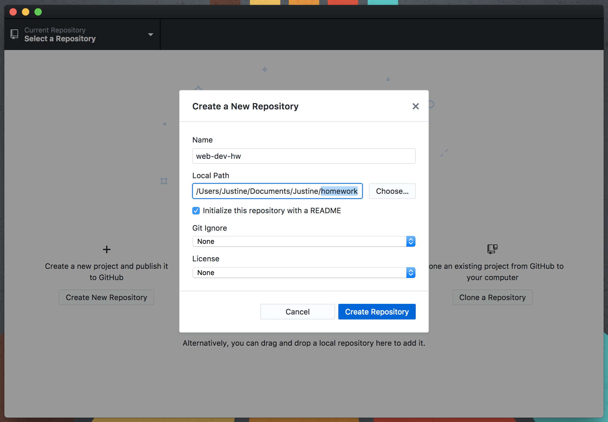
  - You should now see `web-dev-hw` listed under "Current Repository" in the upper-left corner. You can check for your file history by clicking "History."
  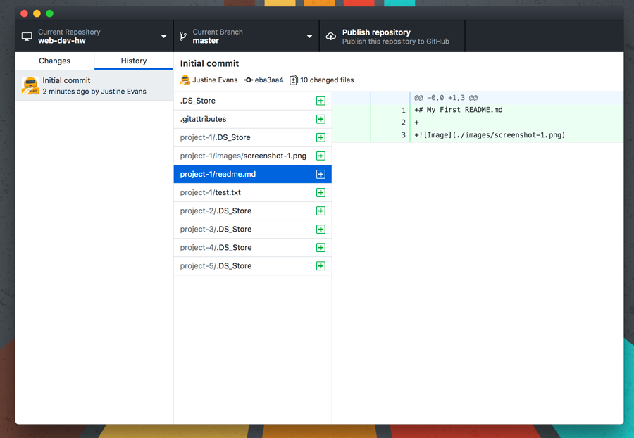

---

#### For Windows

1. After downloading the application, right click the application in the Downloads folder from the file explorer and select "run as administrator".
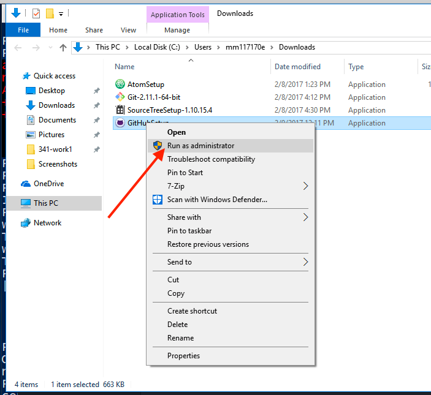
2. Allow installer to run.
3. When presented with a "Log in" screen, log in to your GitHub.com account using your username and password. Then Select "Log in"
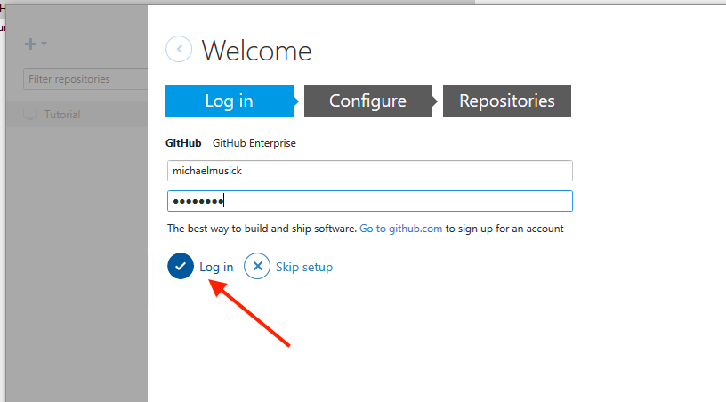
4. Configure Git by enter your full name and e-mail. Then click "continue."
5. To create a repository in GitHub Desktop you will need to click the "+" button in the top left corner of the window.
6. Select "Create."
6.  **Very Important:**  We are going to initialize this directory as a Git repo, not create a brand new one.
  - Name this "new" repository the _exact_ same name as the directory you created earlier.
  - When browsing for the local path, select the folder _one level higher_ than your `web-dev-hw` folder.
  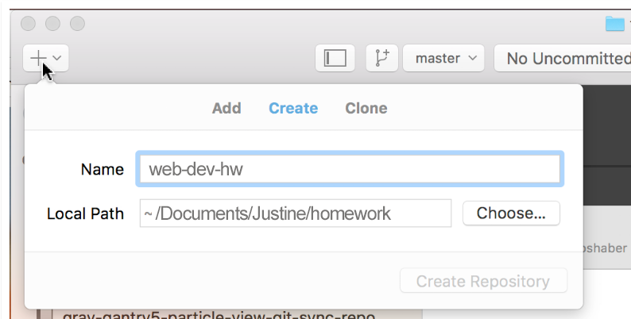
  - You should now see `web-dev-hw` listed under "Current Repository" in the upper-left corner. You can check for your file history by clicking "History."
  

---

### Making Commits with GitHub Desktop App (macOS and PC)

Since GitHub Desktop is nearly identical between mac and PC, I will only be including one set of instructions for this section. If you get confused, please email your instructor.

Let's now learn how to make commits of our file changes with GitHub Desktop. The first thing we should do is open our repo in Atom.
1. Assuming Atom was able to perform a normal, full-permission install, you should be able to right click on the repo name in the "repository browser" area in the left of the applications window.
2. Then you can click "Open in Atom".  This will open Atom, with the repository directory active.
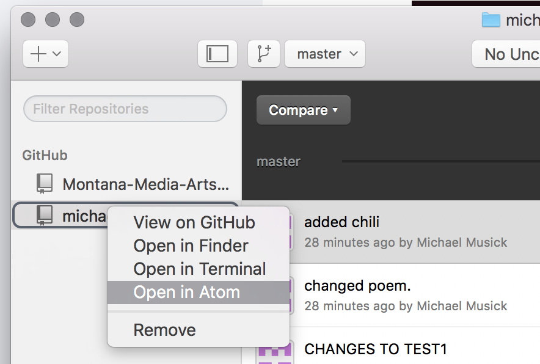
3. Open your Project 1 `README.md`. Add another line of text.
4. Save the file.
5. Back in the GitHub Desktop App, you should now see that the center button says something like "1 Uncommitted Change".
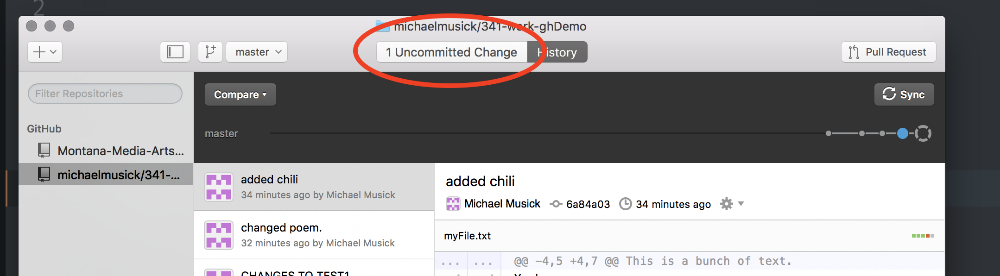
6. Make sure this button is select by clicking it. It will turn dark-grey and display the "commit window". In here you can select/un-select files to group in a single commit.
7. When you select a file, it will show the differences since the last commit of that file on the right side of the window.
8. Where it says "Summary" is where you enter commit messages.
  - You must enter a commit message with every commit, or the program will prevent you from saving your commit. An appropriate message would be "Added line about..." or something of that nature.
  - Below the commit message box is the button to actually create the commit. Press "Commit to master."
  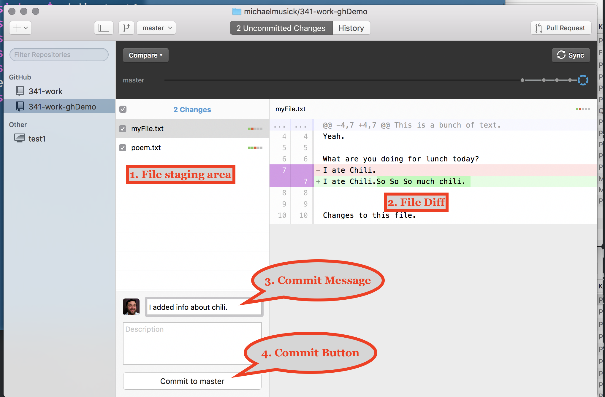

### Publishing your Repo
The process of linking GitHub Desktop to GitHub.com is a rather straight forward procedure.

1. From GitHub desktop this is done very easily by pressing the "Publish repository" button on the top-right of the application window.
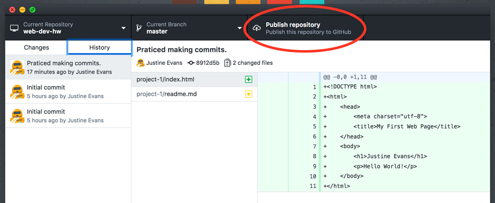
2. Sign into your GitHub account if prompted. You may also need to click "Publish repository" again.
3. When the Publish Repository window comes up, make sure your directory is named as it should be (in my case, `web-dev-hw`).
4. window comes up, label the repository **web-dev-hw**, add a description, make sure your account is selected if given the option.
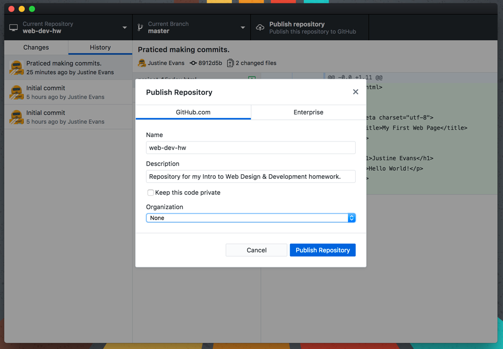

#### View on GitHub
If you don't get an error message, you should be good to go. To check if all your files uploaded and the repo was created successfully, you should navigate to Github.com.

You can do this the normal way by opening your browser and simply typing in your account site address of https://github.com/username, or you can select "View on GitHub" from the Repository menu.
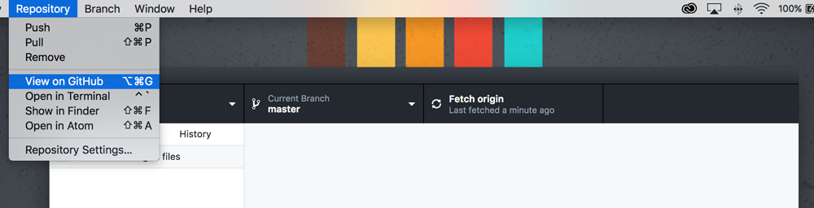

If you go to your GitHub account, you should now see your `web-dev-hw` repository!
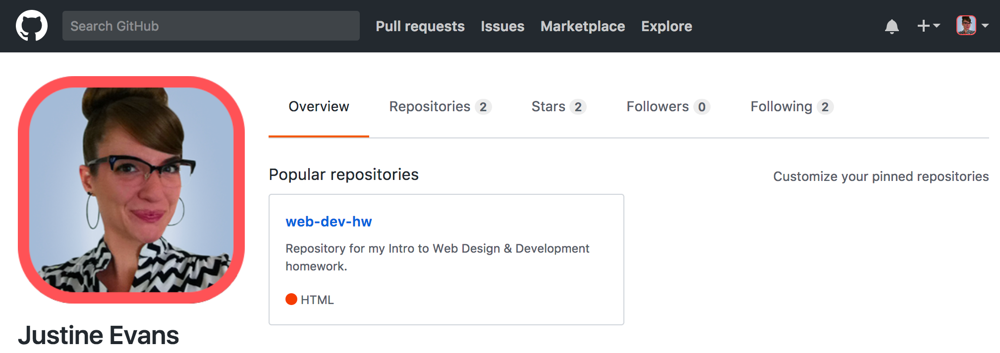

### Pushing Changes
In Atom, open your README.md and add some sentences about your work so far. Make sure you **save** the file!

Back in GitHub Desktop:
1. Create a new commit to go along with your changes.
2. Press "Commit to master."
3. The button that used to say "Publish" should now say "Push" or "Sync." Press it.
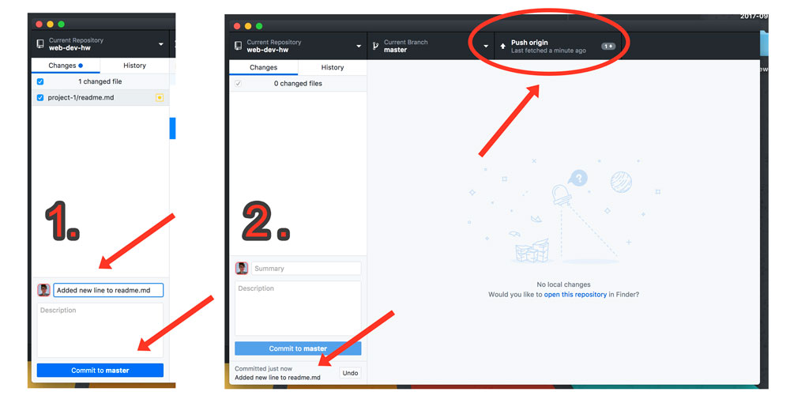

Whenever you commit new changes to your Git repo via GitHub Desktop, you need to remember to save any files and press "Push" or "Sync" when you are done working. This "pushes" you changes to the remotely hosted version of your repository on GitHub.com.

### Success Pushing
To verify success in pushing the repo and/or your changes, go to your GitHub.com account.

Select your `web-dev-hw` repository. You should see the files you added to your repo on the GitHub.com site, as well as any changes ("commits") you've made.

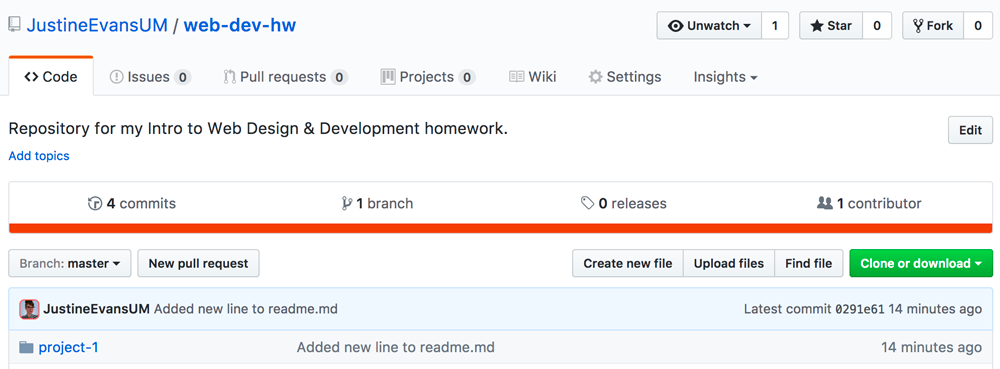

You can now select any of these files to view their contents. Likewise, you can select the “commits” tab to see all of the commits you have made in your repo so far.

# { TODO: }
Practice changing files, saving them, and making commits in GitHub Desktop Application.

Click on both the "Uncommitted Changes" and the "History" buttons to explore the different types of information shown. In the History view, click on different commits to see what files changed and how.
