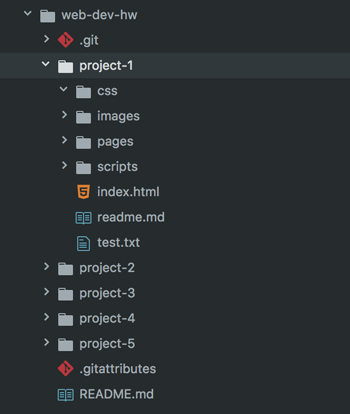
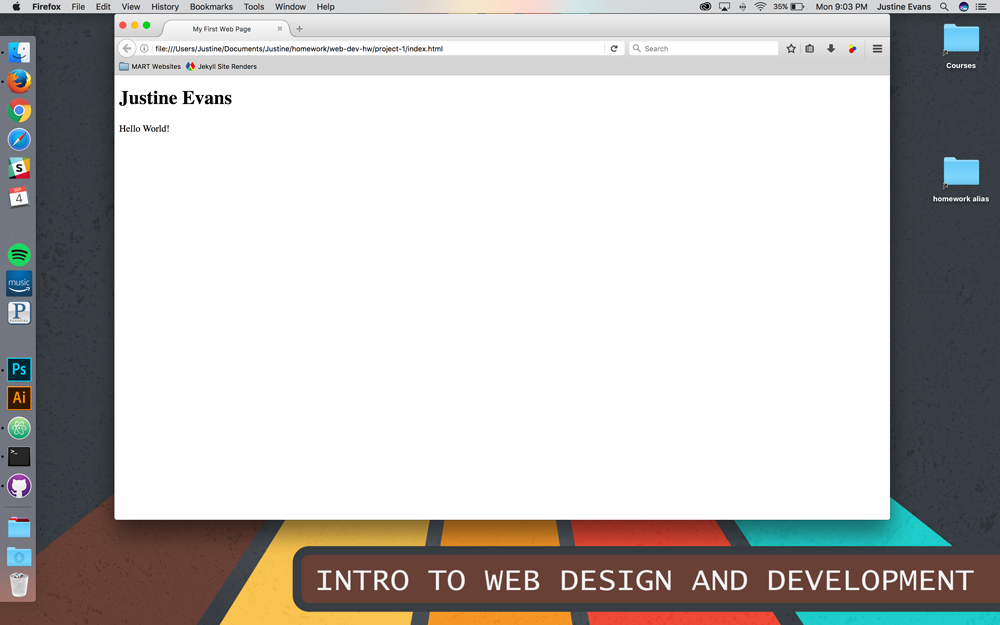

## Your First Web Page:


Now that you know the basics of HTML it is time to write an HTML document and get it up on the web!

### index.html
1\. In Atom, create a new file and save it in `/project-1` as (and _only_ as) **index.html**. <br />


2\. **Copy and paste** the document structure below directly into your `index.html`. We will go over this in-depth next topic.
<p data-height="400" data-theme-id="30567" data-slug-hash="brJNRa" data-default-tab="html" data-user="Media-Ed-Online" data-embed-version="2" data-pen-title="brJNRa" class="codepen"></p><script async src="https://production-assets.codepen.io/assets/embed/ei.js"></script>

3\. Add add one `h1` element and one `p` element. Populate these elements with your name, and the statement “Hello World!”, respectively.
<p data-height="400" data-theme-id="30567" data-slug-hash="MvRYvZ" data-default-tab="html,result" data-user="Media-Ed-Online" data-embed-version="2" data-pen-title="Topic-02: My First Web Page! Pt. 2" class="codepen"></p>
<script async src="https://production-assets.codepen.io/assets/embed/ei.js"></script>

#### Opening the File in a Browser
Wow, that's an incredible first page. Time to view it in a browser! You have a few options to open this file:

- Double click the `index.html` file, as this should open the file in your default web-browser.
- Simply Drag the file to the browser you want it to open in.
- Install the "open-in-browser" package for Atom and then either press `cntrl` + `opt` + `q` (macOS), `cntrl` + `alt` + `q` (PC), or from the command palate type "Open in Browser."

You should now see your file open in a web browser, looking something like this.


#### Make Some Changes
Back in your `index.html` document, add a new line before line 10. There you should add a new paragraph element that includes the following text:

<div id="code-heading">HTML</div>
``` html
<p>This is my first web page!</p>
```

Your code should look like the following:
<p data-height="400" data-theme-id="30567" data-slug-hash="gxybdX" data-default-tab="html,result" data-user="Media-Ed-Online" data-embed-version="2" data-pen-title="Topic-02: My First Web Page! Pt. 3" class="codepen"></p>
<script async src="https://production-assets.codepen.io/assets/embed/ei.js"></script>


### And For Your Assignment...
For your assigment and the completing of _My First Web Page!_, we want you to add one of your favorties from this list:
- Haiku
- Long Quote (100+ Characters
- Song Lyrics (Bridge or Verse)

Using what you now know about HTML and web pages, try and structure the line breaks of your choice using either `<p>` and `<br />` or `<pre>` elements. Here's mine:
<p data-height="600" data-theme-id="30567" data-slug-hash="xLogmW" data-default-tab="html,result" data-user="Media-Ed-Online" data-embed-version="2" data-pen-title="Topic-02: My First Web Page! Pt. 4" class="codepen"></p>
<script async src="https://production-assets.codepen.io/assets/embed/ei.js"></script>
[See it in action!](https://justineevansum.github.io/web-dev-hw/project-1/) on my GitHub.io site.

# { TODO: }
Navigate back to your browser and refresh your web page (`cmd` + `r` in macOS, `cntrl` + `r` in Windows) as you work on your assignment. You should see the updates in your code reflected in the browser.
