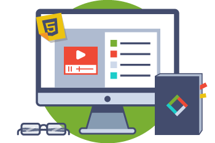

# Topic 04:   HTML Pt. 1
It's time to really begin working with **HTML**. Project 1, _You're First Web Page!_ was made using HTML, although you may not have really understood what each character meant.

We'll begin by going over the elements you were exposed to last Topic, and conclude with a more involved `index.html` poised to head Project 2.

This includes:

- `!DOCTYPE` Declaration and Other Main Elements
- Semantic Markup
- Lists

## Overview of Project 2

<b>Project 2: The Instructable</b>

Your second project is all about the web's major language, and creating functional, clean code.

<i>Duration: 3 Topics/Weeks</i>

# Topic Goals
By the end of this Topic, you should have begun Project 2 and started your "Instructable," or illustrated step-by-step guide. This first part (or page) will be your `index.html`, which will contain your overview and project summary.

Explore the [Instructables website](https://www.instructables.com/) to get some ideas!

Project Part 

