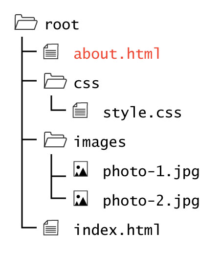
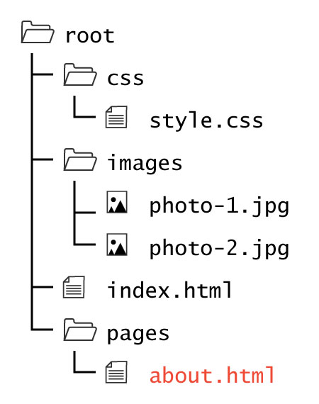

## All About `index.html` Files:

If you remember from last Topic, **HTML** or "HyperText Markup Language" is the standard markup language for creating web pages and web applications.

You are going to create a lot of files labeled `index.html`. When a URL is passed to a browser that does not specify a file, the browser automatically requests `index.html` from the host server.

Essentially, this means something like `http://baseurl.com` and `http://baseurl.com/index.html` are the _same_. (This is not true for all websites, but for many.)

### File- vs Directory-Based URLs

This assumption allows for the publication of "clean URLs," as we do not need to explicitly include the <code>index.html</code> at the end of the URL. This is not to say that we could not have additional pages that we explicitly address. For example we could have additional html pages at the same directory level, such as an <code>about.html</code>.

The URL for this case would look like <code>baseurl.com/about.html</code>.

However, if you wished to have a “cleaner” looking URL, you could create an additional child directory labeled <code>/about</code> and place an <code>index.html</code> within that directory. 

The URL for this case would look like <code>baseurl.com/about/</code>. Notice how we do not use the <code>.html</code> and instead the URL ends with a directory slash.

For our class, we created each of our <code>/project</code> directories with a child directory called <code>/pages</code>. It will contain all of our additional <code>.html</code> pages. This is good for those of us learning directory structure for the first time, but because this child directory will not have an <code>index.html</code> file to request,  <code>baseurl.com/pages/</code> will most likely return a 404 error.

The URL for this case would look like <code>baseurl.com/pages/about.html</code>.

### Why is this important?
This discussion was had so that you could understand why I had you label your file as `index.html` in Project 1. This is why you did not need to add `index.html` at the end of your path. This file now lives at a URL that looks something like `baseurl.github.io/web-dev-hw/project-1/`.

### /web-dev-hw/project-2/
Start up Project 2 with its very own set of files:

1. In Atom, create a new file and save it in `/project-2` as **index.html**.

2. You should also create a `README.md` and begin documenting your progress for Project 2!

# { TODO: }
1. Read pages 1-11 of the Introduction from [Duckett](https://github.com/Media-Ed-Online/intro-web-dev/issues/3).
2. If you need a refresher, please review the _URL_ page of [Topic-02](https://media-ed-online.github.io/intro-web-dev/modules/topic-02/urls/).
