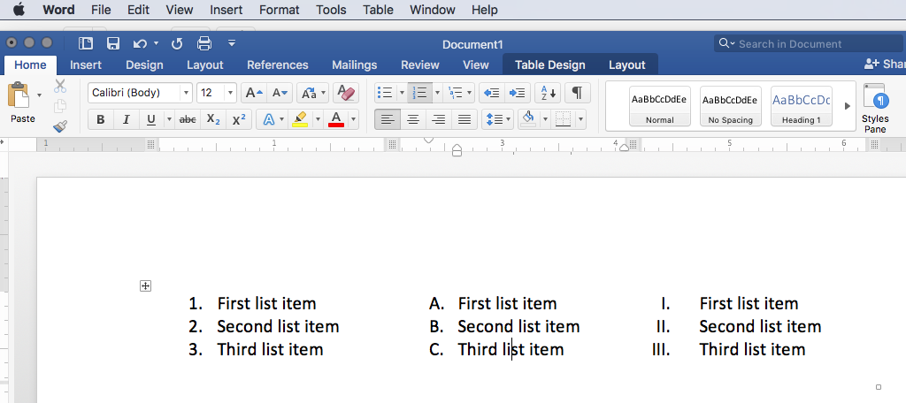

## Lists in HTML:

Lists are a typical part of structured documents. Lists can be used to convey information like sets of instructions, elements in a set, definitions, and outlines.

There are two major types of lists that are often used;

1. Ordered lists
2. Unordered lists

### Ordered Lists
Ordered lists are those where each entry is prepend with an ascending identifier such as numbers, letters, or roman numerals.

To identify a list, the content must be surrounded by the ordered list tags. ( `<ol>...</ol>` )

Each “list item” must be surrounded by the list item tags. ( `<li>...</li>` ).

### Unordered Lists
Unordered lists are those that which begin with dots, bullets, dashes, or other visual signifiers. These lists are great for things like ingredients in a recipe.

Unordered lists, by default, get a dot in most browsers.

To identify an unordered list, the content is contained within the unordered list tags. ( `<ul>...</ul>` ).

As with the ordered list, each list item is contained within a list item element. ( `<li>...</li>` )

### Nested Lists
You can combine list types as well as use multiple nested list elements to create hierarchically related lists. This is particularly useful for outlines or multi-part recipes, as examples.

NOTE: Notice how the nested list is contained _within_ the parent "list-item" element. Select "Result" to see the render.

### Definition Lists
Definition lists are used to define terms. A definition list is identified with `<dl>...</dl>` tags.

The term being defined is encapsulated in "definition term" tags. (`<dt>...</dt>`)

The terms definition is then encapsulated in the "definition" tags. (`<dd>...</dd>`)

**NOTE:** Sometime you might see a list where there are two terms used for the same definition or two different definitions for the same term. This is acceptable.

# { TODO: }
Read pages 62-73 of Chapter 03 in [Duckett](https://github.com/Media-Ed-Online/intro-web-dev/issues/3).
