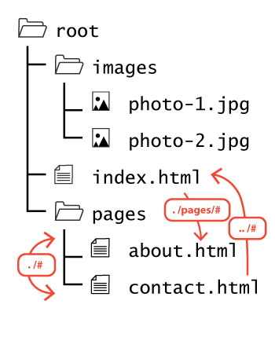
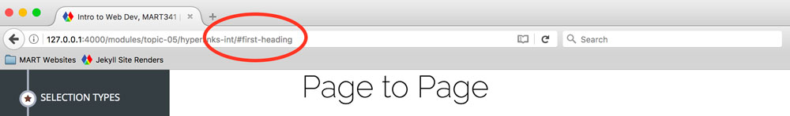

## Hyperlinks:<br />Linking Internally in the Site


**Relative URLs** contain no protocols or domain information. This is convenient because they are shorter, but can _only_ reference files in the same path.

It also should be noted that in the language of web design, the `index.html` file is referred to as the **home page** once hosted, as it becomes the "entry" to your site. It is also the page most users will return to again and again as your "base of opperations," as it were.


<h3 id="first-heading">Page to Page</h3>
Relative URL's help with building a site locally before pushing it to the web. This way you can develop on your local machine, and still have links to pages be valid.

<div style="display: inline-block; width: 100%;">
<p>But how do we navigate to a different directory using a relative URL?</p>
<p>Well, if a single "<code>.</code>" states that we need to remain in the current level of our directory heirarchy, two "<code>..</code>" is effectively saying <i>"to find this file, begin here and then step back a directory."</i></p>
<!--afterwards, go down inside the pages folder, where you'll see about.html.-->
</div>

Here are some ways you would link these files:
- From Index to About: `<a href="./pages/about.html">To About</a>`
- From About to Contact: `<a href="./contact.html">Contact Me</a>`
- From Contact to Index: `<a href="../">Back to Home</a>`

<h3 id="second-heading">Specific Part of the Same Page</h3>
We can use the "id" attribute in HTML to create links to specific portions of a page.

One attribute that can be assigned to almost any HTML element is `id`. This attribute is used to assign unique identifiers to each element, so that those specific elements can be referenced through HTML, CSS, or JavaScript. When assigning an element an id, you should ensure that no other element is given the same.

To assign an element an unique identifier, you should include the following code in the opening tag.

<div id="code-heading">HTML</div>
```html
<h3 id="first-heading">"Page to Page" Section</h3>
<h3 id="second-heading">"Specific Part of the Same Page" Section</h3>
```

**NOTE:** IDs should be treated like variables in other languages, with regards to the naming conventions. If you would like a refresher on HTML Attributes, please read W3School's [page about the subject](http://www.w3schools.com/html/html_attributes.asp).

With regard to naming conventions, please consider the following:

1. The value should be surrounded by double quotes (i.e. `name=“value”`).
2. For IDs, the value should start with a lowercase letter (i.e. a-z).
3. IDs can contain lowercase letters, uppercase letters, numbers, and some special characters (although the latter should typically be avoided).
4. ID’s should be explicit and clear with regard to what they are referencing.(i.e. “firstSection”, “aside-paragraph”, “hero\_image”).
5. Try to avoid abbreviations for words in IDs (i.e. “first-paragraph” over “firPara”).
6. When creating IDs that are multiple words, you should follow one of three conventions. Additionally, you should follow this convention in _all of your code_, so that there is consistency to your work and style.
	-  _camelCase_; [Camel Case](https://en.wikipedia.org/wiki/Camel_case) pushes multiple words together into a single word, capitalizing the first letter of every word, except for the first (i.e. `name="exampleValueHere"`)
	- _hyphen-separated_; Each word is separated by a hyphen ( `-` ) character.
	- _underscore\_separated_; Each word is separated with an underscore ( `_` ) character.

To link to an HTML element with an assigned id, simply use the id in the hyper-reference (`href`), prepended with a hashtag character (`#`).

In the following code, the link in line 1, would connect to the `h2` element in line 3.

<div id="code-heading">HTML</div>
```html
<a href="#first-heading">"Page to Page" Section</a>
<br />
<a href="#second-heading">"Specific Part of the Same Page" Section</a>
```
See it in action!
- Up to the <a href="#first-heading">"Page to Page" Section</a>.
- Up to the <a href="#second-heading">"Specific Part of the Same Page" Section</a>.

Notice how the URL changed in your address bar when you clicked one of those links?



# { TODO: }
Read pages 80-93 of Chapter 04 in [Duckett](https://github.com/Media-Ed-Online/intro-web-dev/issues/3).
