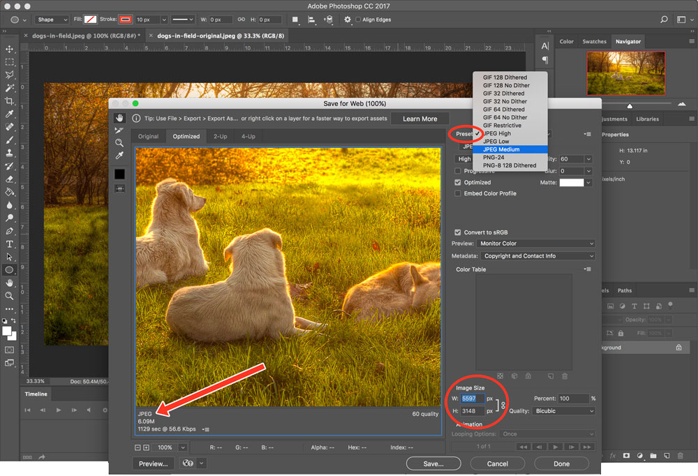
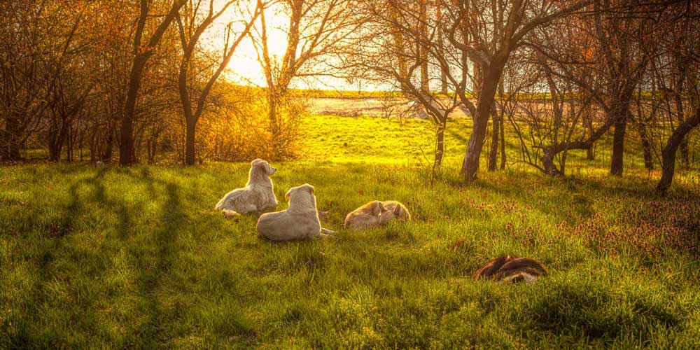

## More Ways to Work With Images:

There are a lot of details about images you need to learn.

These focus around the specifics of using images and some general rules of thumb you should keep in mind:

1. Save the image in the right format.
2. Save images at the right size (width and height, resolution).
3. Measure image `width=""` and `height=""` in pixels.

### Save For Web
Generally, images should be **less-than 1,000 kB** in size (under 1 megabyte).

<!-- If you remember from your introductory design classes, creating and saving files for print is much different than for web. For example, printers print at _300 ppi_, but screens on need _72 ppi_ for proper resolution. --> The larger your files, the longer it will take your page to load. And no one likes a slow-loading page.

To optimize images for the web, many image editors have a "Save for Web and Devices" or "Export As" in their save options. There, you can change image formats and sizes to try and get your files of an appropriate size.

Here is the <a href="../imgs/dogs-in-field-original.jpeg" target="_blank">original dog image</a>, which clocks in at an _enormous_ 23.9 mB, and 5597px by 3148px. Watch how long that loads in another tab.

In contrast the one you see below was optimized for web, sized and cropped to 1000px x 500px. It's much more managble at 110 kB, and is hardly distinguishable from the original (at least on the web).

### Figure & Figcaption
With HTML5, a couple new elements were introduced to further assist with images. These are “figure” (`<figure>`) and “figure caption” (`<figcaption>`). These can be used together to easily group figures or images with associated captions.

The figure element is used as a container to group together one or more images with a caption. Within the figure element, you would place your img or related elements.

Within this figure element you will also place your caption elements.

#### More On Images
If you have time, you should explore more about images:

- Read [Google Developer Site’s “Image Optimization”](https://developers.google.com/web/fundamentals/performance/optimizing-content-efficiency/image-optimization)
- Read the following article on ["The Hero Image Trend in Web Design"](https://envato.com/blog/exploring-hero-image-trend-web-design/)
- Look at AWWWARDS [Best Website Examples of Designs with Big Background Images](http://www.awwwards.com/websites/big-background-images/)
- Look at the following article on examples of effective use of images by [Gisele Muller](https://webdesignledger.com/20-examples-of-effective-image-usage-in-web-design/).

# { TODO: }
Read pages 120-123 of Chapter 05 in [Duckett](https://github.com/Media-Ed-Online/intro-web-dev/issues/3).
