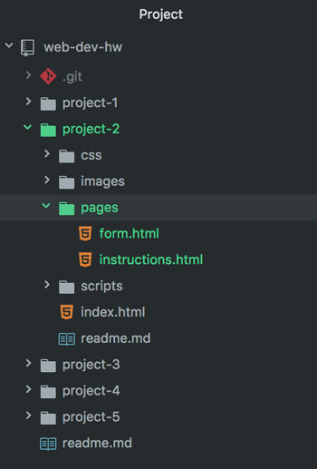

## Topic Homework Assignment:<br/>HW-02: "Figures & Froms"


These are the requirements for your homework this Topic. You should go through all of the materials before beginning, so these requirements make sense.


### /web-dev-hw/project-2/
Continue your Project 2 by creating two pages:

1. In Atom, create a new file and save it in `/project-2/pages` as **instructions.html**.
2. Create another new file and save it in `/project-2/pages` as **form.html**.

3. Remember to use proper !Doctype, HTML root, `<head>` and `<body>` elements on these pages:

<div id="code-heading">HTML</div>
```html
<!DOCTYPE html>

<html>
    <head>
        <!-- At least the Title Element needs to be inlcuded. -->
        <title>This is the title of this page.</title>
    </head>
    <body>
        <!-- Body content goes here. -->
    </body>
</html>
```
Review [this page](https://media-ed-online.github.io/intro-web-dev/modules/topic-04/head-elements/) if you need to.

<div style="border-top: 5px dotted #1CCDCA; width: 100%; margin-top: 150px"></div>
<div style="border-top: 5px dotted #1CCDCA; width: 100%; margin-top: 20px"></div>


### `index.html`

Go back to your Project 2 **index.html**. At the bottom of your content, add a _relative link_ to your **instructions.html**. Your link may look something like this:

<div id="code-heading">HTML</div>
```html
<a href="./pages/instructions.html">Proceed to Instructions</a>
```
<div style="border-top: 5px dotted #1CCDCA; width: 100%; margin-top: 150px"></div>
<div style="border-top: 5px dotted #1CCDCA; width: 100%; margin-top: 20px"></div>


### `instructions.html`

This page is for your step-by-step instructions, be they cooking directions, lesson content, how-to crafting guide, etc. This page will utilize:
  - A Table
  - Images or Figures
  - Semantic HTML
  - Links

#### Requirements

##### **Table**
All related content needs to be grouped by rows into a table. This could be "step 1," and image of that step, written content about that step, and/or related numerical data ("prep time," date, amount, etc).

The content of your form is up to you, but needs to include:
1. The `<table>...</table>` element to contain your table.
2. Use of `<th>`, `<td>`, and `<tr>` to structure the table.
3. **1 use styling**, such as padding, borders, or sizing.

##### **Images**

You may create **or** source images from the internet to add to your instructions, either as page decoration, content, or as visuals for the steps presented in your table.

Where you place your images is up to you, but you need to include:
1. At least **3 separate images** in your page.
2. Proper file management of these images:
    - Placed in your `/images` child directory.
    - Use of relative URLs in their `src=""` attributes.
    - Appropriately sized in both pixels and file-size.
3. Uses of these specific attributes:
    - Descriptive `alt=""` text.
    - Relavent `title=""`.
    - Include `width=""` and `height=""` values. Watch your ratios - you can't just make these up.

##### Continuing **Semantic HTML**

Your `instructions.html` page should contain these code instances, that you learned about in [Topic-04](https://media-ed-online.github.io/intro-web-dev/modules/topic-04/semantic-markup/):

1. Abbreviations & Acronyms ( `<abbr title="">...</abbr>` )
- Example: 1 <abbr title="teaspoon">tsp</abbr> vanilla.
2. Definitions ( `<dfn>...</dfn>` )
- Example: In mathematics, <dfn>pi</dfn> is the ratio of a circle's circumference to its diameter.
3. Citations ( `<cite>...</cite>`)
- Example: The theme to Beethoven's <cite>_Symphony No. 9_</cite> (or "Ode to Joy"), is a staple song to learn for any beginning instrumentalist.

#### Links

This page will need _relative links:_
1. To your form.
2. Back to the index ("home page").

<div id="code-heading">HTML</div>
```html
<!-- These are just examples. Your links may look different. -->
<ul>
  <li><a href="./form.html">Take the Quiz!</a></li>
  <li><a href="../index.html">Back to Home</a></li>
</ul>
```

<div style="border-top: 5px dotted #1CCDCA; width: 100%; margin-top: 150px"></div>
<div style="border-top: 5px dotted #1CCDCA; width: 100%; margin-top: 20px"></div>


### `form.html`

This page will contain a form of some type that's applicable to your Instructable. This could be something like:

- "Submit an image of your cupcake for the community blog!"
- Quiz on your lesson contents.
- Order form for supplies.

#### Requirements

##### **Form**

The content of your form is up to you, but needs to include:
1. The `<form>` element (including `action="#"` and `method=""`) to wrap the form elements in.
2. One or more `<fieldset>` elements to group form elements.
3. The use of `<label>` elements to make all form elements accessible.
4. **5 of the other 10 form element types** presented here (such as text, selection, file upload, or HTML5 elements). Try for 5 _different_ types.
5. Uses of these specific attributes:
    - You should use the `autofocus` attribute on the first form element.
    - At least one of your form elements must use the `require` attribute.
    - You should use the `placeholder=""` attribute in at least one form element.
    - You need to use appropriate `name=""` attributes for each formfield.
6. A "Submit" button (with or without image) at the end of the form.

If you decide to go with a catalogue or cookbook-like form entry, this is also a great place to use imagery!

#### Links

This page will need _relative links:_
1. Back to your instructions.
2. Back to the index ("home page").

<div id="code-heading">HTML</div>
```html
<!-- These are just examples. Your links may look different. -->
<ul>
  <li><a href="./instructions.html">Need a hint?</a></li>
  <li><a href="../index.html">Back to Home</a></li>
</ul>
```

# { TODO: }
1. Use the previous pages of the Topic to complete you homework assignment.
2. Continue documenting your Project's progress in your `README.md`!
