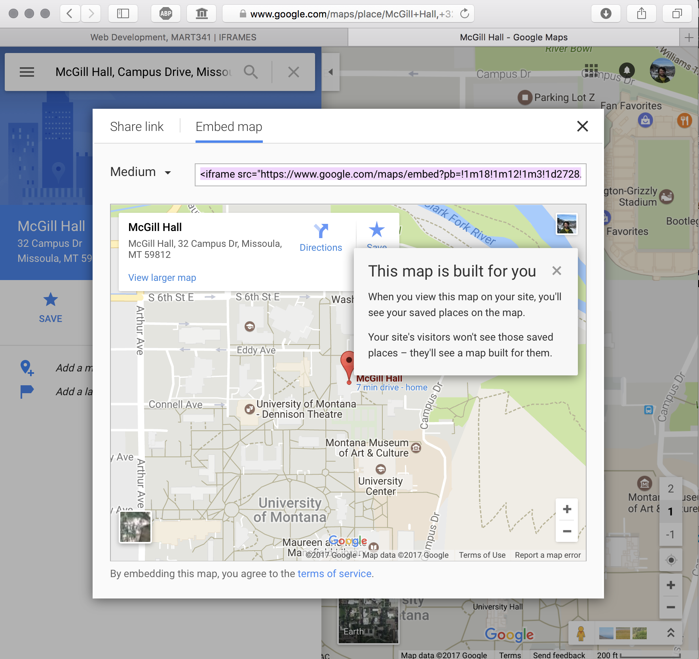

## IFRAMES:


When a developer needs to include HTML from an external source or a separate external site on their site, they can use the `<iframe>` element. This element can be thought of as a window, with a view onto another webpage or part of another webpage.

### iframe Attributes

#### source
<p style="font-size: x-large"><span style="color: #999"><iframe</span> <span style="color: #79AF33; font-weight: bold;">src="#"</span> <span style="color: #999">width="..." height="..." />...</iframe></span></p>

The source (`src=""`) attribute specifies a URL of the external HTML to load.

#### width & height
<p style="font-size: x-large"><span style="color: #999"><iframe src="#"</span> <span style="color: #79AF33; font-weight: bold;">width="..." height="..."</span> <span style="color: #999">/>...</iframe></span></p>

As with the image element, you should always specify the amount of space the `<iframe>` element is suppose to take up on a page. This allows the browser to reserve the appropriate amount of space for the element, even if it takes longer to load than the rest of the page. These attributes are also important when pulling in external websites, as they may be built to use the whole page themselves.

#### seamless

In HTML5, you should use the `seamless` attribute with the iframe element when scrollbars are not desired. It is in the process of being accepted by browsers.


#### Altogether Now
We can use the iframe element to pull in my [School of Media Arts](http://www.umt.edu/mediaarts/people) profile.

NOTE: This is not an empty element. You should include a closing tag when using the iframe element. Otherwise, unexpected results may occur.

<div id="code-heading">HTML</div>
```html
<iframe width="100%" height="600px" src="https://media-ed-online.github.io/intro-web-dev/"></iframe>
```

<div class="displayed_code_example">
<iframe width="100%" height="600px" src="https://media-ed-online.github.io/intro-web-dev/"></iframe>
</div>

### Google Maps

In addition to displaying other webpages in the main webpage, the iframe element is often used to display two specific types of instances. The first of these is to include Google maps.

From the Google maps page, after completing a search, you can click the "share" button. This opens a separate pop-up, where you should select the "Embed map" option. You can then tweak the display options, and copy Google's iframe code to include on your site.



Including this code on your site will create an embedded google map that your visiting users may interact with. Typically, this is useful in showing where something is.

<div id="code-heading">HTML</div>
```html
<iframe src="https://www.google.com/maps/embed?pb=!1m18!1m12!1m3!1d2728.0484933883513!2d-113.9858143984305!3d46.86241807904005!2m3!1f0!2f0!3f0!3m2!1i1024!2i768!4f13.1!3m3!1m2!1s0x535dcc33c3d4cbd5%3A0xd77cd4f46bdf5b89!2sMcGill+Hall%2C+32+Campus+Dr%2C+Missoula%2C+MT+59812!5e0!3m2!1sen!2sus!4v1488574173329" width="600" height="450" frameborder="0" allowfullscreen></iframe>
```

<div class="displayed_code_example">
    <iframe src="https://www.google.com/maps/embed?pb=!1m18!1m12!1m3!1d2728.0484933883513!2d-113.9858143984305!3d46.86241807904005!2m3!1f0!2f0!3f0!3m2!1i1024!2i768!4f13.1!3m3!1m2!1s0x535dcc33c3d4cbd5%3A0xd77cd4f46bdf5b89!2sMcGill+Hall%2C+32+Campus+Dr%2C+Missoula%2C+MT+59812!5e0!3m2!1sen!2sus!4v1488574173329" width="100%" height="300" frameborder="0" allowfullscreen></iframe>
</div>


### Videos and Music

The other common use of the embeddable iframe element is to include media players in your site, such as YouTube, Vimeo, Soundcloud, or Bandcamp.

The process of using these services is similar to that Google map example. From the content you wish to use:

- find the "share" link
- select "embed" as opposed to "share link" tab
- copy the iframe code
- paste it to your site

```html
<!-- Soundcloud Example from UM's own Dr. Michael Musick -->
<iframe width="100%" height="166" scrolling="no" frameborder="no" src="https://w.soundcloud.com/player/?url=https%3A//api.soundcloud.com/tracks/247762625&amp;color=ff5500&amp;auto_play=false&amp;hide_related=false&amp;show_comments=true&amp;show_user=true&amp;show_reposts=false"></iframe>
```

<div class="displayed_code_example">
    <iframe width="100%" height="166" scrolling="no" frameborder="no" src="https://w.soundcloud.com/player/?url=https%3A//api.soundcloud.com/tracks/247762625&amp;color=ff5500&amp;auto_play=false&amp;hide_related=false&amp;show_comments=true&amp;show_user=true&amp;show_reposts=false"></iframe>
</div>

<br />


```html
<!-- YouTube Example form UM's own Dr. Michael Musick -->
<iframe width="560" height="315" src="https://www.youtube.com/embed/-0wEUKJTHnQ" frameborder="0" allowfullscreen></iframe>
```

<div class="displayed_code_example">
    <div class="embed-responsive embed-responsive-16by9"><iframe class="embed-responsive-item" src="https://www.youtube.com/embed/-0wEUKJTHnQ" frameborder="0" allowfullscreen></iframe></div>
</div>


# { TODO: }
Read pages 189-190 of Chapter 08 in [Duckett](https://github.com/Media-Ed-Online/intro-web-dev/issues/3).
