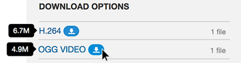

## Managing Media:


[HTML5](https://developer.mozilla.org/en-US/docs/Web/Guide/HTML/HTML5) introduced new features, specifications, and elements. One of the stated goals for the W3 Consortium with these new specs was to address 'multimedia' in order to "make video and audio first-class citizens in the Open Web."

From this work came two new elements, the `<video>` and `<audio>` elements. As their names imply these elements are intended to provide multimedia functionality to webpages.

As with all stages in web design, it is important to keep a well-organized media directory. And as HTML5 is still in development and being accepted by browsers, we need to provide text or fallback files should the intended media files or elements not be accessible.

### Media Storage

As with image files, you are encouraged to store multi-media files in a separate sub-directory so as to keep the directory structure of your site clean.

The following demonstrates a possible directory structure:

<div id="code-heading">BASH</div>
```bash
your-site/
├── index.html
├── images/
│   ├── image-01.png
│   └── image-02.jpg
└── media/
    ├── audio-01.mp3
    ├── audio-01.ogg
    ├── video-01.mp4
    └── video-01.webm
```

### Good Places to Source Audio and Video

All media you use on your sites should be your own or in "fair public use," usually under [Creative Commons](https://creativecommons.org/) (CC) public licence. **You should always credit the author when asked to do so.**

Always test your pages on multiple computers and browsers to make sure the embedded media works.

**NOTE:** GitHub has a repo limit of **20 megabytes**, which is pretty small when thinking about audio and video. Here are some options for finding smaller audio/video files to use:

#### Video

 A cellphone video is a good option, or [The Moving Image Archive](https://archive.org/details/movies) as creative-commons video that you can download, which conviently show metadata like size and filetype. Here's an example about [Pluto](https://archive.org/details/Pluto_Flyby):

<center><div style="width: 400px;">
<iframe src="https://player.vimeo.com/video/237977600?autoplay=0&loop=1&color=1CCDCA&title=0&byline=0&portrait=0" width="400" height="300" frameborder="0" webkitallowfullscreen mozallowfullscreen allowfullscreen></iframe>

<p style="font-size: small; color: #333; text-align: left; margin: 0">Notice how hovering your cursor over the download link shows you the file size? Most videos give you the two required options you need: H.264 (<code>.mp4</code>) and an open-source type (<code>.ogg</code>).</p>
</div></center>

#### Audio

Again, [The Audio Archive](https://archive.org/details/audio) is a great source of royalty-free and creative commons audio works, usually offered in MP3 format.

A personal favorite for music is through [Incompetech.com](https://incompetech.com/music/royalty-free/collections.php), which offers a ton of free-use (credit required) music and background audio.

##### Converting Files

You likely will not have access to the original file to export an .ogg file, whether it's a song you own or have recently sources. You may need to use an online converter like [Convertio](https://convertio.co/mp3-ogg/) or [Zamzar](http://www.zamzar.com/convert/mp3-to-ogg/) to provide a .ogg file. Again, this is only a band-aide; ideally, you're providing your own created audio (music, recordings, sound effects, etc) which you can export as an .ogg legally.

# { TODO: }
1. Read pages 200-213 of Chapter 09 in [Duckett](https://github.com/Media-Ed-Online/intro-web-dev/issues/3).
2. Explore either your own files or some of resources above, looking for a video or audio file you think would reference your Instructable material well. More on this is provided on the [Homework](../homework/#self-hosted) page.
