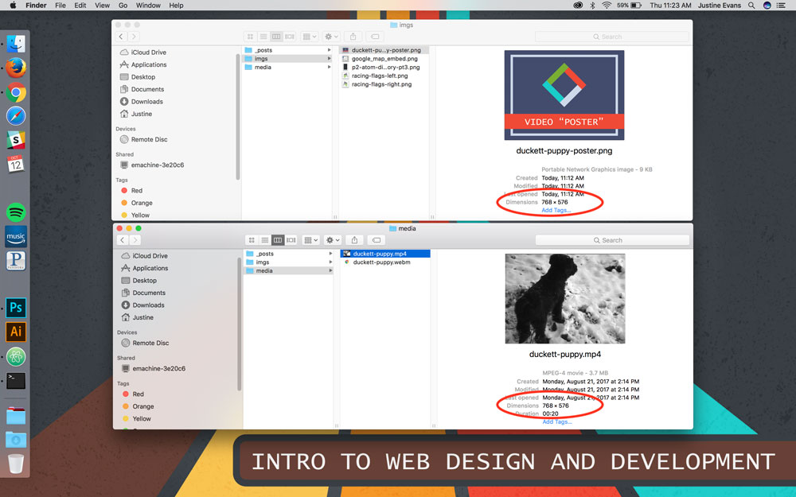

## Video in HTML5:


Tthe `<video>` element allows developers to add a video player to webpages.

### Attributes

### source

As with other HTML elements, the `<video>` element takes a `src=""` attribute, which accepts a URL (relative or absolute) to the video file.

#### poster

The `poster=""` attribute should always be supplied with the `<video>` element. This attribute takes a URL as its value. This URL should point to an image that is displayed in place of the video until the end-user tells the browser to play the video.

**NOTE:** The image should be the same width/height ratio as the video element.


#### width & height
The `width` & `height` attributes specify the size of the player in pixels.

#### preload

The `preload` attribute takes one of three values and tells the browser how to load the video file if `autoplay` is not present.

- `preload="none"` tells the browser to do nothing until told to do so by the user.
- `preload="auto"` tells the browser to download the media file when the page loads.
- `preload="metadata"` tells the browser to only collect metadata, such as size and length.

#### controls
The `controls` attribute is passed alone and does not require a trailing value. This attribute indicates whether the player should display controls. If you do not use this attribute, no controls will be shown by default.

#### loop

The `loop` attribute, when present, tells the browser to loop the file.

#### autoplay

Like the `controls` attribute, the `autoplay` attribute is included as a single word or not at all. When present, this attribute tells the browser to start playing the file on load.

**NOTE**: This is considered poor-practice, and in most cases, it is better to let the user choose whether to start the video or not.


### Browser Support and the Source Tag

As with many HTML5 elements including the `<video>` and `<audio>` elements, not all browsers support the same format. Therefore, even with HTML5 you need to provide your files in multiple formats.

#### Video
Required self-hosted video formats:

- H264: IE and Safari
- WebM or OGG Video: Android, Chrome, Firefox, Opera

We use the <source /> element inside the `<video>` element to specify the video source. This would be used in-place of the `src=""` attribute in the video element.

You should include a `<p>` element "fallback" that will be displayed if the browser does not support the video element _or_ the format of video used. The browser will display whatever is between the opening and closing video tags.

You can use multiple source elements, which specifies to the browser the video is available in multiple formats.

**NOTE:** Due to a bug on the iPad, you should provide the MP4 video as the first format.


## Attributes

#### src

Within the source element, the `src=""` attribute specifies the URL.

#### type

Use the `type=""` attribute to tell the browser what format the video is in. (i.e. video/H264, video/mp4) Otherwise, it will download some of the video to see if it can play the file, find that it cannot, and then try the next one until it has exhausted all options or found a valid file format. (**This takes time and bandwidth!**)

The codec that was used to encode the video is supplied within the type attribute, following the video file type, separated by a semicolon (`;`). For example, `type='video/mp4;codecs="avc1.42E01E, mp4a.40.2"'`.

**NOTE:** The use of double and single quotes to delineate.


### Altogether Now

<div id="code-heading">HTML</div>
```html
<video poster="../imgs/duckett-puppy-poster.png" width="768" height="576" preload controls loop>
	<source src="media/ducket-puppy.mp4" type='video/mp4;codecs="avc1.42E01E, mp4a.40.2"' />
	<source src="media/duckett-puppy.webm" type='video/webm;codecs="vp8, vorbis"' />
	<p>A video of a puppy playing in the snow.</p>
</video>
```

<div class="displayed_code_example">
<center>
<video poster="../imgs/duckett-puppy-poster.png" width="400" height="320" preload controls loop>
	<source src="../media/duckett-puppy.mp4" type='video/mp4;codecs="avc1.42E01E, mp4a.40.2"' />
	<source src="../media/duckett-puppy.webm" type='video/webm;codecs="vp8, vorbis"' />
	<p>A video of a puppy playing in the snow.</p>
</video>
</center>
</div>


# { TODO: }
Read pages 213-216 of Chapter 09 in [Duckett](https://github.com/Media-Ed-Online/intro-web-dev/issues/3).
