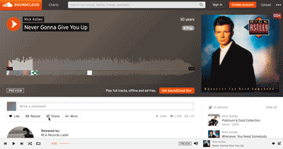

## Notes on Embedded Media:

You do need to be careful when using the `<video>` and `<audio>` elements, as older browsers will not support these elements and the presentation of the associated media. To create pages viewable by all, you should use a variety of approaches to account for multiple ages of browsers. You _should_ also include flash options, as some older browsers will prefer this.

**NOTE:** You should technically use both flash and HTML5 video element when self-hosting. However, it is my opinion that flash is dead, so I have focused solely on HTML5.

### Content Protection

One of the potential issues of using the `<audio>` element is that it allows end-users to easily download the audio file. For example, in Safari, this can be done by right-clicking the audio player and selecting "Download Audio." Chrome actually provides a download button with the audio player.

If content protection is important, you should use a third party service, such as [Bandcamp](https://bandcamp.com/), [SoundCloud](https://soundcloud.com/), or the like. These services have a vested interest in protecting the content on their servers.

The use of these services may also increase browser compatibility, as they want to ensure their content is available to everyone. (**Read:** This means you don't have to worry about browser compatibility issues as much!)

<h3 id="third-party"> Third-Party Hosting </h3>

For the reasons above, it is sometimes preferable and encouraged for you to host your media on sites such as [YouTube](https://youtube.com), [Vimeo](https://vimeo.com), [Bandcamp](https://bandcamp.com/), or [SoundCloud](https://soundcloud.com/).

**The advantage of using a hosted media provider is that you can upload a high-quality version of your media and these sites will handle compatibility, encoding, and the other details necessary for the media to play on a variety of browsers.** Additionally, web hosting companies often charge extra if you use a lot of bandwidth, and due to the size of most movie files, this can occur easily when self-hosting. These third-party options provide you affordable solutions to this potential problem.

To embed third-party hosting, use their provided embed code, which often utilizes the `<iframe>` element discussed this week as well.

YouTube

SoundCloud

**NOTE**: Some services will limit the number of 'plays' that you can have for a certain period of time on the "free-tiers".

### Exclusion Rules

If the content needs to be exclusive to your site, and not available through a third-party site such as YouTube, then you must host the file. You will need to research current best-practices for self-hosting protected content.

### Final Decision

You will need to be aware of all of these options and potential problems and weight all of the requirements of your project to determine the most appropriate route.

# { TODO: }
Review pages 209-210 of Chapter 09 in [Duckett](https://github.com/Media-Ed-Online/intro-web-dev/issues/3).
