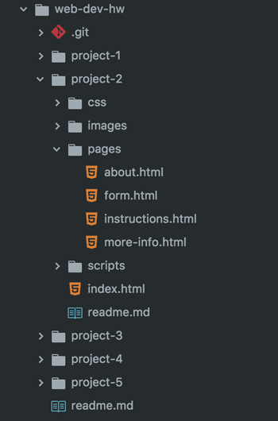

## Topic Homework Assignment:<br/>HW-03: "Managing Media"


These are the requirements for your homework this Topic. You should go through all of the materials before beginning, so these requirements make sense.


### /web-dev-hw/project-2/
Continue your Project 2 by creating two pages:

1. In Atom, create a new file and save it in `/project-2/pages` as **about.html**.
2. Create another new file and save it in `/project-2/pages` as **more-info.html**.

3. Remember to use proper !Doctype, HTML root, meta, `<head>` and `<body>` elements on these pages!

<div style="border-top: 5px dotted #1CCDCA; width: 100%; margin-top: 150px"></div>
<div style="border-top: 5px dotted #1CCDCA; width: 100%; margin-top: 20px"></div>


### `index.html`

Go back to your Project 2 **index.html**. At the bottom of your content, add a _relative link_ to your **about.html** and **more-info.html**. Your links may look something like this:

<div id="code-heading">HTML</div>
```html
<!-- about.html Examples -->
<a href="./pages/about.html">About Me</a>
  <!-- Or -->
<a href="./pages/about.html">About the Project</a>

<!-- more-info.html Examples -->
<a href="./pages/more-info.html">Want to learn more?</a>
  <!-- Or -->
<a href="./pages/more-info.html">Watch the Video! / Hear the Sounds!</a>
```

<div style="border-top: 5px dotted #1CCDCA; width: 100%; margin-top: 150px"></div>
<div style="border-top: 5px dotted #1CCDCA; width: 100%; margin-top: 20px"></div>


### `about.html`

This page is - you guessed it - all about you or the Instructable project in general (its purpose or goal, ect). This page will utilize:
  - IDs, classes, and/or divs.
  - Self-hosted media file.
  - An iframe with Google Map

#### Requirements

##### **Markup**
Your page needs to inlcude **3 paragraphs (`<p>` elements)** about you or your site. Describe your process, why you chose this material for your Instructable, or describe your own creative process. These do not have to be long paragraphs.

The content of your page is up to you, but needs to include:
1. Unique `<id>` attributes for important elements.
2. Include metadata (this should be fairly similar across all your site pages).

(Use more `<div>` and `class=""` elements if you're feeling adventurous!)

<h5 id="self-hosted"><b>Self-Hosted Video or Audio</b></h5>

You need to include a self-hosted video or audio selection on your site. This should be something personal to you or your project contents. A song to listen to while working, or a short insipiring video; I leave it up to you!

- If using a **video** file, you must provide a `.mp4` and open-sourced version (most likey a `.webm` or `.ogg`).
- If using an **audio** file, you must provide a `.mp3` and open-sourced version (most likey an `.ogg`).

Additionally this embed should include at least a heading, and possibly a description (if needed).

<div style="border: 5px dotted #79AF33; padding: 15px; margin-top: 10px">
<p style="margin: 0"><span style="font-weight: bold;">Can't find any media that works?</span> <br />Feel free to use these .mp4 and .webm files of the animated Media Arts logo: <b><a href="../media/mart-logo-animated.zip">Download Zip File</a></b></p>
</div>

##### Contact Me

Conclude your page with a Contact section. This can be fictional or a real address, but it shouldn't be where you live. You can use the University's address if you like:

<div style="margin-left: 30px;">
<a href="mailto:MediaArts@umontana.edu">MediaArts@umontana.edu</a>
<address>University of Montana<br/>School of Media Arts, McGill Hall Rm 224<br/> 32 Campus Dr<br />Missoula, MT 59812</address></div>

To include this, you should:
1. An e-mail link (don't forget `mailto:`!)
2. Wrap your physical address in the `<address>...</address>` element we discussed in [Semantic Markup](../../topic-04/semantic-markup/#markup-list).
3. Use an iframe to embed a Google Map showing your location choice.

#### Links

This page will need _relative links:_
1. Back to the index ("home page").

<div id="code-heading">HTML</div>
```html
<ul>
  <li><a href="../index.html">Back to Home</a></li>
</ul>
```

<div style="border-top: 5px dotted #1CCDCA; width: 100%; margin-top: 150px"></div>
<div style="border-top: 5px dotted #1CCDCA; width: 100%; margin-top: 20px"></div>


### `more-info.html`

This page will be relatively simple and contain a third-party hosted audio or video (hosted on SoundCloud, YouTube or the like). It only needs:

- A heading and short description.
- Properly embeded audio or video file. Revisit the "[Media-Hosting](../media-hosting/#third-party)" page for help.

#### Requirements

##### **Markup**
Include metadata (this should be fairly similar across all your site pages).

##### **Third-Party Hosted Video or Audio**

Find an outside video or audio file that you feels enhances your project. This could be anything: a TV commercial, podcast, video from professional chefs, artisans, or educations... Whatever! It does not have to be long, either. Simply functional.

Additionally this embed should include at least a heading, and possibly a description (if needed).

#### Links

This page will need _relative links:_
1. Back to the index ("home page").

<div id="code-heading">HTML</div>
```html
<ul>
  <li><a href="../index.html">Back to Home</a></li>
</ul>
```

# { TODO: }
1. Use the previous pages of the Topic to complete you homework assignment.
2. Finish documenting your Project's progress in your `README.md`!
