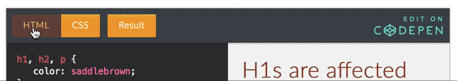

## The Anatomy of Style:


To "style" content in your HTML document you write style "rules" that apply to elements. These rules will always follow the same patterns.

### Selectors and Declarations

#### Selector

The first part of every rule is a "selector" which tells the browser what element(s) the rule applies to. This is followed by a space, then a block, delineated with curly brackets.

#### Declaration

The portion of the rule delineated by the curly brackets is known as the declaration. This tells the browser what to do to the selected element(s).

<div id="code-heading">CSS</div>
```css
/* ⬇ SELECTOR - selects all h1 elements */
   h1 {
     /* ⬇ DECLARATION goes inside curly brackets. */
       color: white;
   }
```


### Multiple Selectors with Different Rules

When applying different rules to elements, you simply need to write another selector/declaration set. The closing curly bracket (`}`) tells the browser the rule is finished.

**NOTE:** CSS is not whitespace dependent. In other words, you do not need to include extra lines between rules. However, this shown style increases readability of your code. _It's polite._

<div id="code-heading">CSS</div>
```css
/* Rule 1: Applied to all h1 elements. */
h1 {
    /* Style declarations go here. */
}

/* Rule 2: Applied to all paragraphs. */
p {
    /* Style declarations go here. */
}
```


### Multiple Selectors with the Same Rules

If you need to apply the same rules to more than one element, you can select multiple elements in a single style rule. To do so, separate each selector element with a comma (`,`).

You can then still go on to apply additional, unique style rules to an already styled element. These rules will simply be cumulative.

<div id="code-heading">CSS</div>
```css
h1, h2, p {
    /* Style Rules applied to all h1, h2, and paragraph elements. */
}

p {
    /* Additional style rules applied only to paragraph elements. */
}
```

### Altogether Now
<p data-height="400" data-theme-id="30567" data-slug-hash="PJxjdr" data-default-tab="css,result" data-user="Media-Ed-Online" data-embed-version="2" data-pen-title="Topic-07: Anatomy of Style" class="codepen"></p>
<script async src="https://production-assets.codepen.io/assets/embed/ei.js"></script>

**NOTE:** You can toggle between HTML and CSS frames in the CodePen embeds by simply clicking on their tabs.

<center></center>


# { TODO: }
Read pages 226-231 of Chapter 10 in [Duckett](https://github.com/Media-Ed-Online/intro-web-dev/issues/3).
