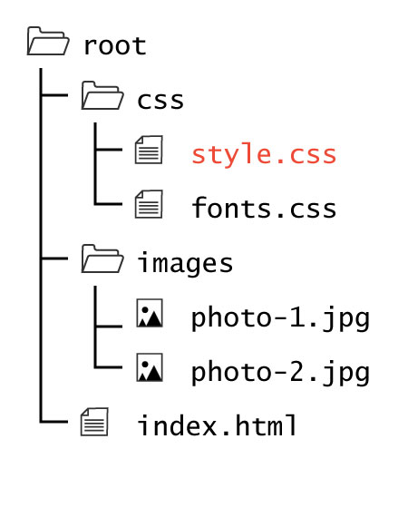

## Where to Style:


There are three general ways to specify CSS style rules:

- Within a CSS Style element in an HTML document.
- In a separate css document.
- Or as an attribute within each element.


### The `<style>` Element

Within an HTML document, for example `index.html`, you can place CSS within a Style Element (`<style>...</style>`).

**NOTE:** You should usually place your style element inside the head element as one of the _last_ entries.

<p data-height="400" data-theme-id="30567" data-slug-hash="jGeERe" data-default-tab="html,result" data-user="Media-Ed-Online" data-embed-version="2" data-pen-title="Topic-07: Where to Style Pt. 1" class="codepen"></p>
<script async src="https://production-assets.codepen.io/assets/embed/ei.js"></script>


### CSS Documents
It is perfectly acceptable to place CSS within the HTML document if the CSS is minimal, like we did in Project 2. Usually, however, you should place CSS in one or more external "style sheets."

<div style="display: inline-block; width: 100%;">
<p>A CSS document is given the <code>.css</code> extension. As with images and media, it is considered best practice to place your CSS documents in a separate child directory labeled either "css" or "style."</p>
</div>

### The Link Tag
<p style="font-size: x-large"><span style="color: #79AF33; font-weight: bold;"><link</span> <span style="color: #999">rel="stylesheet" type="text/css" href="#"</span> <span style="color: #79AF33; font-weight: bold;">/ ></span></p>

It is also necessary to tell the browser to use the style defined within the document. To do this, you will add the "link element" (`<link />`) inside the document's head element. Just like the style element, the link element is typically placed near or at the end of the head element. The link element is an empty element, so it only requires a single tag.

**NOTE:** You may link more than one CSS document by simply including multiple link elements. This is common for larger sites.

### Attributes

#### rel
<p style="font-size: x-large"><span style="color: #999"><link</span> <span style="color: #79AF33; font-weight: bold;">rel="stylesheet"</span> <span style="color: #999">type="text/css" href="#" / ></span></p>

The relationship (`rel=""`) attribute describes the relationship of the linked document to the html document. When linking to a css document, the value for this attribute should "stylesheet" (i.e. `rel="stylesheet"`). You should always include this attribute.

#### type
<p style="font-size: x-large"><span style="color: #999"><link rel="stylesheet"</span> <span style="color: #79AF33; font-weight: bold;">type="text/css"</span> <span style="color: #999">href="#" / ></span></p>

The type attribute tells the browser what type of document you are linking to. This should always be passed as `type="text/css"` when linking to a CSS document.

#### href
<p style="font-size: x-large"><span style="color: #999"><link rel="stylesheet" type="text/css"</span> <span style="color: #79AF33; font-weight: bold;">href="#"</span> <span style="color: #999">/ ></span></p>

Provide the relative or absolute URL as the value to the `href=""` attribute. This tells the browser where the document is located at.

To link to an external style sheet located in the directory structure discussed above you would include the following line in your head element.

<div id="code-heading">HTML</div>
```html
<link rel="stylesheet" type="text/css" href="css/style.css">
```

**NOTE:** When linking the same stylesheet in your child pages of this structure, you would need to add the additional `..` to move up a directory.

<div id="code-heading">HTML</div>
```html
<!-- For example, an About.html in your "Pages" child directory: -->
<link rel="stylesheet" type="text/css" href="../css/style.css">
```

<p data-height="400" data-theme-id="30567" data-slug-hash="KXEdMr" data-default-tab="html,result" data-user="Media-Ed-Online" data-embed-version="2" data-pen-title="Topic-07: Where to Style Pt. 2" class="codepen"></p>


### The Style Attribute

The last way of specifying style is to include the rule as the value for a style attribute in any HTML element.

As with the global `class` and `id` attributes, every HTML element can be passed a global `style` attribute. This value takes a string, formatted as valid CSS.

**NOTE:** Valid CSS will be discussed over the next few pages.

<p data-height="600" data-theme-id="30567" data-slug-hash="XeyVwO" data-default-tab="html,result" data-user="Media-Ed-Online" data-embed-version="2" data-pen-title="Topic-07: Where to Style Pt. 1" class="codepen"></p>

# { TODO: }
Read pages 235-236 of Chapter 10 in [Duckett](https://github.com/Media-Ed-Online/intro-web-dev/issues/3).
