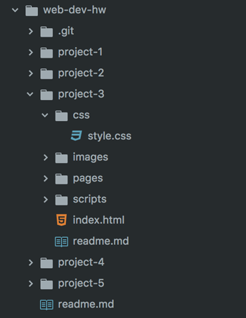

## Topic Homework Assignment:<br/>HW-04: "Color"*

*Not due till next Topic


There is no true assignment for this Topic. Rather, it's our hope that you take this time to explore CSS on your own, and play around. You should begin thinking about the contents of your site, but no real structue will be required until HW-05: Typography.

You **are** required to create a detailed readme for this Project however, containing ideas and a color palette. You should take this time to begin that process, and start getting your Project 3 set up:

### /web-dev-hw/project-3/
Begin your Project 3 by creating your README.md, pages, and CSS file:

1. In Atom, create a new file and save it in `/project-3` as **readme.md**
2. Create another new file and save it in `/project-3` as **index.html**.
3. Create another new file and save it in `project-3/css` as **style.css**



#### Standard Page Structure
By now you should be familiar with the basic structure of HTML pages, including their `!DOCTYPE` and `<head>` elements. It's always good practice to get this section laid out early. Skim "[Reviewing the Head](../../topic-06/reviewing-the-head#full-review)" again if you need a refresher.


### Project Overview

Project 2 and _The Instructable_ got you comfortable with stuctural and semantic HTML. Project 3 and the _Literature Showcase_ will emphasize CSS, specifically color, typography, and layout.

This project will need images, fonts, and written content, so you may need to do a little research/prep:
- Think of a written piece you'd like to showcase and its related website style. Please choose from:
  - A blog post (most likely written by you).
  - An article (news, sports, culture, arts, etc).
  - A book, short story, poem, or essay. (You'll only need a sample snippet you like of its writing, not the whole piece.)
- You're also expected to gather some information:
  - The full work, or an example written portion (a few paragraphs, at least).
  - Provide a short bio about the author, even if it's yourself. You can cite this material.
  - Have contact information to a publisher, fan-club, etc. You can also make this up.
  - Provide reviews. These can also be fake, but there are lots of legit reviews out there.


<div style="border-top: 5px dotted #1CCDCA; width: 100%; margin-top: 150px"></div>
<div style="border-top: 5px dotted #1CCDCA; width: 100%; margin-top: 20px"></div>


### `index.html`
Play and experiment with linking your index and stylesheet! Try adding a heading and some paragraphs to your index - maybe even some classes - and referencing them in your CSS. This is your time to mess around!

#### Link to Your CSS

This page will need a _relative link_ to your stylesheet.

<div id="code-heading">HTML</div>
```html
<!DOCTYPE html>
<html lang="en">
  <head>
    <link rel="stylesheet" type="text/css" href="./css/style.css">
    <title>Your Site's Title</title>
  </head>
  <body>
    <!-- Page Content -->
  </body>
</html>
```

<div style="border-top: 5px dotted #1CCDCA; width: 100%; margin-top: 150px"></div>
<div style="border-top: 5px dotted #1CCDCA; width: 100%; margin-top: 20px"></div>


### `README.md`
All design goes through an ideation phase, where you brainstorm ideas and possibilities. For our last Project we'll look at the process of **wireframing** (blueprinting) for the web, but for Project 3, we just want you to share your ideas in text and images.

Start your README by laying out your ideas:
1. What type of writer's site do you think you'll make? (Blog, News, Book, etc.)
2. Where will you get your material? ("Write it myself," use this <u>book title</u>, cite <cite>this article</cite>, etc)
3. What will you say about the author, even if it's yourself?
4. **Include an image of your color palette.** You should have _2-6 colors max!_
5. If you have some inspirational images, add them! Do you remember how to do this [in Markdown](../../topic-02/read-me/)?

Here is my example:

<div class="displayed_code_example">
<iframe width="100%" height="500px" src="https://JustineEvansUM.github.io/web-dev-hw/project-3/sample.html"></iframe>
</div>


# { TODO: }
1. Read the previous pages of the Topic, and experiment with CSS.
2. Begin your Project 3 `README.md`, sharing what your plans are for this project.
