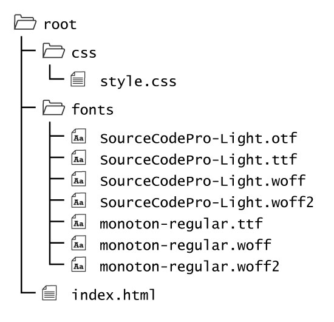
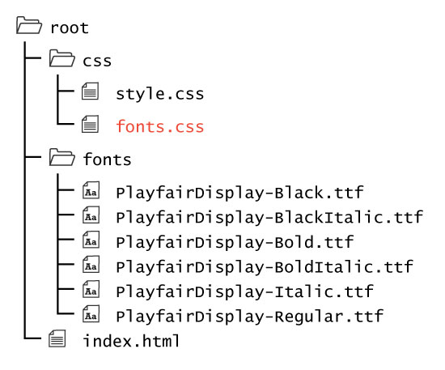

## External Fonts

As a developer you will want to include specific fonts for certain sites. These fonts may be part of the brand, add personality, be integral to the overall design aesthetic, or serve a special purpose.

Developers can include external fonts a number of ways. However, when including external fonts, you should keep in mind that this is an additional resource the client computer will have to download. This may impact speed and performance. Therefore you should only include external fonts with _purpose_, and ensure that you only include fonts you are actually using.

### Fonts from Your Server

One way to include an external font is to place its resource files in a sub-directory, similar to how images, style sheets, and other external resources are handled.

#### @font-face

To include an external font, you first must tell the browser to load the font and what to refer to it as. To do this, use the `@font-face` rule in your CSS.

This rule is formatted like other CSS selectors, but instead of being used to alter HTML elements, it is used to load in data for CSS to use.

The `@font-face` rule takes three properties.

##### src: url and format

The source property (`src: url() format()`) tells the browser where to load the font from via the `url()` function, and what type of font it is via the `format()` function.

As with audio and video, not every browser is capable of reading and using every type/format of font. Therefore, you will need to include multiple types of fonts in order to cover support for all browsers.

For information on what browsers support what types of font formats please read:

- [Web-Font Formats](https://transfonter.org/formats)
- [W3Schools' Web Font Info](https://www.w3schools.com/css/css3_fonts.asp)

As you can see, you will need to include multiple versions of every font you want to use in order to ensure compatibility.

##### Directory Structure

As mentioned above, your font files should be placed in a child-directory, labeled something along the lines of `fonts/`.

Lets assume, we have two fonts, to be used for headings and paragraphs, respectively;

- ['monoton'](https://fonts.google.com/specimen/Monoton)
- ['Source Code Pro'](https://github.com/adobe-fonts/source-code-pro/releases/tag/2.030R-ro/1.050R-it)

We will have the following directory structure.

To use these fonts we would include an <code>@font-face</code> for each font, along with relative url's for each font type. This allows us to ensure compatibility with all browsers.

**NOTE:** This css is applying the `monoton` font to the heading and `Source Code Pro` to the paragraphs.

  

  

  

    
    <h1 class="main-heading-ex-fonts">I Love This Font!!!</h1>
    

        It is <strong>interesting</strong> how two fonts can compliment or distract from one another. You should try to choose fonts that easily flow and delineate the content of your webpage.
    

  

### Font Weights and Styles

Notice in the example above, that in the code, the inline syntax element "<strong>...</strong>" has been placed around the word "interesting". Depending on the browser you are using, this word may or may not have appereard in bold, like we asked it to.

This relates to the discussion of font weight and font stye had in the last few pages. We have only imported one type of the 'Source Code Pro' family; the 'light' type. When we ask the browser to display the text as **"strong"/"bold"**, it tries to look for the specific font package, with the name 'Source Code Pro', that has been identified as the **'bold'** version. Since none has been specified as such, the browser decides if it will try and make the font bold itself, or just display the text as is.

**NOTE:** This little example shows that if you intend to make more than one version of a font available, such as bold, or true italic, you will <u>have to</u> also include these font packages and tell the browser as much.

When importing a font with `@font-face`, there are two additional properties that can be set, `font-weight: ` and `font-style: `. Setting these during font import makes them available to the browser.

To use the font, then simply specify the weight and/or style in the css element rule, (as discussed in the last few pages) matching what you specified during font import.

##### An Example

In the following example, six types of the font-family 'Playfair' are imported. There are three weights of this font;

- regular
- **bold**
- **900 (Also known as 'Black' or 'extra-bold')**

Each weight has a 'regular' and _'italic'_ version.

When selecting the font for use, the CSS specifies the `font-weight:` and `font-style:` which then allows the browser to call the correct font package.

For this example, the font import statements have also been moved into their own css file; `fonts.css`. These allows the main css style file to be cleaner in appearance. Notice that the `fonts.css` file is linked in the html file before the `style.css` file. This is important in allowing the latter file to 'see' the fonts.

For this example, the font import statements have also been moved into their own css file; <code>fonts.css</code>. These allows the main css style file to be cleaner in appearance. Notice that the <code>fonts.css</code> file is linked in the html file before the <code>style.css</code> file. This is important in allowing the latter file to 'see' the fonts.

  

  

  

    
    <body>
        <h1 class="one">Testing This Font, YO!</h1>
        <h1 class="two">Testing This Font, YO!</h1>
        <h1 class="three">Testing This Font, YO!</h1>
        <h1 class="four">Testing This Font, YO!</h1>
        <h1 class="five">Testing This Font, YO!</h1>
        <h1 class="six">Testing This Font, YO!</h1>
    </body>
  

# { TODO: }
1. Read pages 277-278 of Chapter 12 in [Duckett](https://github.com/Media-Ed-Online/intro-web-dev/issues/3).
2. Explore this area on our "[Go Further With Fonts](../going-further#pseudo-classes)" page.
