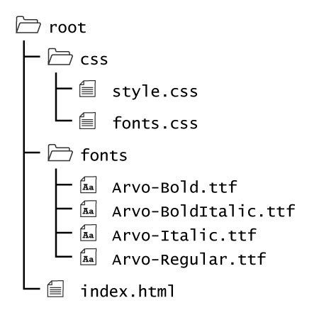

## Where to Get Fonts


Now that you know how to include a font, you need to know where to get them from.

Perhaps more importantly, you need to know _what fonts you can use_.

### License

As with any content you find on the web that you want to use in your own projects, you must check its license to see if you are legally allowed to use it in the way you intend.

As with images, music, and video, fonts will fall under many different types of licenses. Some are very restrictive and require licensing fees, others will be given an MIT, GNU, or some other more open license.

However, even with these more open licenses, some fonts will still restrict what mediums they can be used freely on. This may include;

- Personal use only (This restricts you to using this font only on your computer for word processing or graphic design. But will typically allow the work to be published to hard copy.)
- Web embedding (This allows you to use the font for a website)
- E-Book (This allows you to embed the font in digital content beyond the web)
- Applications (This allows you to embed the font in a stand-alone application)


## Locations

As with anything, a simple google search with a query like ["free web fonts"](http://lmgtfy.com/?q=free+web+fonts) should return many lists and resources.

A few specific locations though include;

- [Font Squirrel](https://www.fontsquirrel.com/)
    - This site has many GNU/MIT fonts, as well as "paid" fonts.
    - This site also links to other font sites.
- [Font Spring](https://www.fontspring.com/free)
    - This is trying to be a for-profit type site. However, there are many fonts which the site will give up for free, or release a few of the font-varieties from a larger family for free.
- [Google Fonts](https://fonts.google.com/)
    - Google runs everything. Of course they also have a font service.

<h3 id="google-fonts-download">An Example<br />Downloading a Google Font</h3>

<style>
  h4 {
    font-weight: bolder;
    color: #F92672;
  }
</style>

Let's look at how to get a font, with Google's font service.

#### 1. Navigate
Navigate to the [Google Fonts page](https://fonts.google.com/).


#### 2. Browse
Browse their font collection. When you find one you like, select it. I am selecting [Arvo on Google Fonts](https://fonts.google.com/specimen/Arvo?selection.family=Arvo:400,400i,700,700i).


#### 3. Select
From the top right of the browser, click the red "SELECT THIS FONT" button.


Then select the black "Family Selected" box that will pop-up in the bottom of the window so that it is visible.


#### 4. Select Additional Font Styles
Now, select the "CUSTOMIZE" tag, where you can select the additional styles you may need. I am selected every style so that I can use this font as a general purpose font.

**NOTE:** Some fonts will not have every style.


#### 5. Download
In this pop-up box, select the download button from the top right. This will download the selected font to your computer.


Try it yourself: [Download the Arvo family](https://fonts.google.com/download?family=Arvo)!

#### 6. Open the Directory
This will download a ZIP'd directory to your computer. Unzip this directory.

Inside the directory will be the font packages. There should also typically be a license file that will specify how you may use the font.


#### 7. Move the Fonts
<div style="display: inline-block; width: 100%;">
<p>Select all of the fonts from this directory that you intend to use, and move them to a <code>fonts/</code> directory in the web project you are working on.</p>

<p>For a basic project, the directory may look like the following:</p>

<p><b>NOTE:</b> There are both a <code>fonts.css</code> and <code>style.css</code>.</p>
</div>


#### 8. Link the Style Sheets
In your `index.html` file, add links to your style sheets in the head element.
`NOTE:` Make sure you link the `fonts.css` document first.

<div id="code-heading">HTML</div>
```html
<link rel="stylesheet" href="./css/fonts.css">
<link rel="stylesheet" href="./css/style.css">
```

#### 9. Link the Fonts
Next, in your `fonts.css` document, link to the individual fonts so they may be used. Use the `@font-face` function to accomplish this.

For our example, the following would be in the CSS file:

<div id="code-heading">CSS (css/fonts.css)</div>
```css
@font-face {
    font-family: 'Arvo';
    src:
        url('../fonts/Arvo-Regular.ttf') format('opentype');
    font-weight: normal;
    font-style: normal;
}
@font-face {
    font-family: 'Arvo';
    src:
        url('../fonts/Arvo-Italic.ttf') format('opentype');
    font-weight: normal;
    font-style: italic;
}
@font-face {
    font-family: 'Arvo';
    src:
        url('../fonts/Arvo-Bold.ttf') format('opentype');
    font-weight: bold;
    font-style: normal;
}
@font-face {
    font-family: 'Arvo';
    src:
        url('../fonts/Arvo-BoldItalic.ttf') format('opentype');
    font-weight: bold;
    font-style: italic;
}
```

**NOTE:** Google only supplied us with 'truetype' fonts. This _should_ be fine for most browsers. If compatibility was a concern, you would need to find all of the files, or convert the font packages to the other types with a service like [Font Squirrel Generator](https://www.fontsquirrel.com/tools/webfont-generator)


<h4 id="apply-css">10. Apply in CSS</h4>

Next, in the `style.css` file, apply the font to be used as the "base font" for your web project site. You can use the "everything selector" to accomplish this.

**NOTE:** Remember to also include backup fonts, in case your font does not work or load for some reason.

<div id="code-heading">CSS (css/style.css)</div>
```css
* {
    font-family: 'Arvo', serif;
}
```

#### 11. Write Your Content

Last, write your content in the `index.html`.

For example purposes, I wrote the following;

<div id="code-heading">HTML</div>
```html
<!DOCTYPE html>
<html>
    <head>
        <meta charset="utf-8">
        <title>Download Google Fonts</title>
        <link rel="stylesheet" href="./css/fonts.css">
        <link rel="stylesheet" href="./css/style.css">
    </head>
    <body>
        <header>
            <h1>I Think Arvo is a Cool Font!</h1>
        </header>

        <main>
            <p>This is some plain ol' text, in a paragraph.</p>
            <p>This is a paragraph with <em>emphasized</em> or <em>italic</em> content.</p>
            <p>This is a paragraph with some <strong>strong</strong> content.</p>
            <p>This is a paragraph with both <strong>strong</strong> and <em>emphasized</em> text <strong><em>TOGETHER!!!!</em></strong></p>
        </main>
    </body>
</html>
```

#### 12. Result

Altogether, your `fonts.css`, `style.css`, and `index.html` should look like the following:

<div class="pen-group">
  <p data-height="600" data-theme-id="30567" data-slug-hash="qVEMKL" data-default-tab="css" data-user="Media-Ed-Online" data-embed-version="2" data-pen-title="[Topic-08] External Fonts, Pt. 3 (FONTS.css)" class="codepen"></p>
  <script async src="https://production-assets.codepen.io/assets/embed/ei.js"></script>
  <p data-height="400" data-theme-id="30567" data-slug-hash="aVzajR" data-default-tab="html,css" data-user="Media-Ed-Online" data-embed-version="2" data-pen-title="[Topic-08] External Fonts, Pt. 3 (STYLE.css)" class="codepen"></p>

  <div class="pen-result displayed_code_example_pen">
    <style>
        @font-face {
            font-family: 'Arvo';
            src:
                url('../fonts/Arvo-Regular.ttf') format('opentype');
            font-weight: normal;
            font-style: normal;
        }
        @font-face {
            font-family: 'Arvo';
            src:
                url('../fonts/Arvo-Italic.ttf') format('opentype');
            font-weight: normal;
            font-style: italic;
        }
        @font-face {
            font-family: 'Arvo';
            src:
                url('../fonts/Arvo-Bold.ttf') format('opentype');
            font-weight: bold;
            font-style: normal;
        }
        @font-face {
            font-family: 'Arvo';
            src:
                url('../fonts/Arvo-BoldItalic.ttf') format('opentype');
            font-weight: bold;
            font-style: italic;
        }
        .h1-arvo, .p-arvo {
              font-family: 'Arvo', serif;
        }
    </style>
    <header>
         <h1 class="h1-arvo">I Think Arvo is a Cool Font!</h1>
    </header>
    <main>
         <p class="p-arvo">This is some plain ol' text, in a paragraph.</p>
         <p class="p-arvo">This is a paragraph with <em>emphasized</em> or <em>italic</em> content.</p>
         <p class="p-arvo">This is a paragraph with some <strong>strong</strong> content.</p>
         <p class="p-arvo">This is a paragraph with both <strong>strong</strong> and <em>emphasized</em> text <strong><em>TOGETHER!!!!</em></strong></p>
    </main>
  </div>
</div>


# { TODO: }


<div style="display: inline-block; width: 100%;">
<p>Attempt to recreate this <code>fonts.css</code>+<code>style.css</code>+<code>index.html</code> combo using GoogleFont's <a href="https://fonts.google.com/specimen/Arvo)" targe="_blank">Arvo</a>.</p>

<p>You can also <a href="../files/font-example.zip" target="_blank">download my example</a>, if that's easier.</p>
</div>
