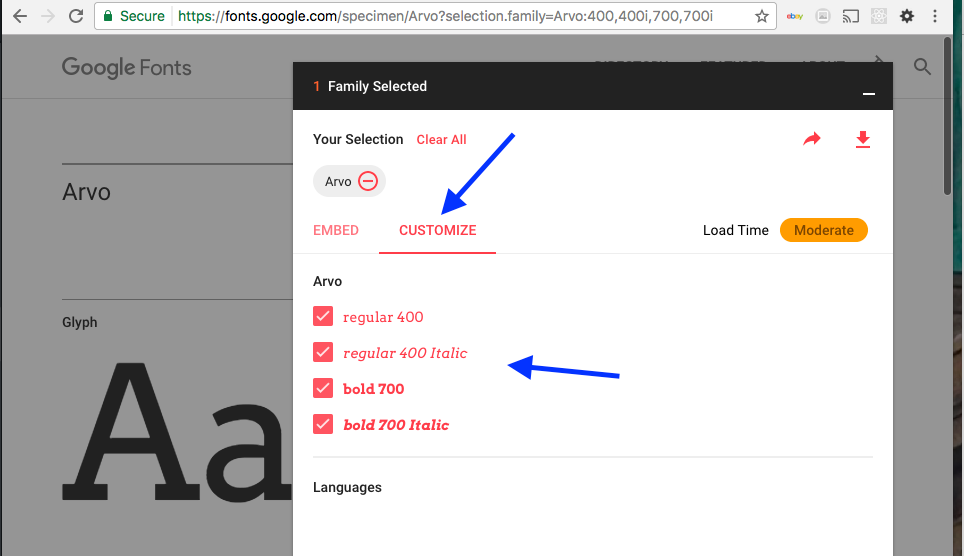

## External Fonts from the Web


Sometimes, as with embedding movies and audio, it is easier and more efficient to utilize a service that will deliver the fonts via their servers.

This type of service will allow you to not worry about font-package types. As the service will often query the browser and deliver the appropriate type. Additionally, this means that you do not have to manage the fonts on your server space.

Google Fonts, in addition to allowing for font downloads, also provides a font server service.

There are embed links from the same pop-up window that allows you to download a font-package. Simply copy the HTML or CSS embed code from their site into the appropriate place. Then specify the font in CSS rules.

### An Example<br />Linking a Google Font

<style>
  h4, h5 {
    font-weight: bolder;
    color: #F92672;
  }
</style>

As an example, lets do the same thing as the previous page, but instead, use Google's embed code.

To do this, we will pick up after step 4.

**NOTE:** Make sure you have still selected a font, and gone into the CUSTOMIZE tag to select any additional font styles you may need.



#### Steps 1 through 4
Please refer back to the "[Example with Google Fonts](../get-fonts#google-fonts-download)" area of the previous page.

<h4 id="google-fonts-link">5. Embed</h4>

Instead of downloading the fonts, select the "EMBED" tag next to "CUSTOMIZE".


Then depending on whether you want to include the embed code in your HTML _OR_ CSS, select the "STANDARD" tag _OR_ "@IMPORT" tag.

Then copy the code below in the gray box.

##### **STANDARD**


This would go in the `<head>` element of `index.html`:

<div id="code-heading">HTML</div>
```html
<link href="https://fonts.googleapis.com/css?family=Arvo:400,400i,700,700i" rel="stylesheet">
```


##### **@IMPORT**


This could be placed either in:

1. a CSS file, such as at the top of your `style.css` file.
2. the `index.html` file inside a `<style>...</style>` element.

**NOTE:** Where ever you place it, you must make sure it appears before you try to assign the font.

If we placed this in our css file, it would appear at the top like:

<div id="code-heading">CSS</div>
```css
@import url('https://fonts.googleapis.com/css?family=Arvo:400,400i,700,700i');
```

#### 6. Use the Font

At this point, the font is ready for use. We could pick up from [step 10 on the previous page]({{base.url}}/modules/topic-08/get-fonts/#apply-css).

<div style="display: inline-block; width: 100%;">
<p>To accomplish the same thing as the previous page, our final code would look like the following:</p>

<p><b>NOTE:</b> We are using the "HTML link" method from Google fonts for embedding the font code. As such, this is placed in our HTML. It does not usally need an additional CSS "fonts" file.</p>
</div>

<div class="pen-group">
  <p data-height="400" data-theme-id="30567" data-slug-hash="bYNQBO" data-default-tab="html,css" data-user="Media-Ed-Online" data-embed-version="2" data-pen-title="[Topic-08] External Fonts, Pt. 4" class="codepen"></p>
  <script async src="https://production-assets.codepen.io/assets/embed/ei.js"></script>

  <div class="pen-result displayed_code_example_pen">
    <link href="https://fonts.googleapis.com/css?family=Arvo:400,400i,700,700i" rel="stylesheet" />
    <style>
        .h1-arvo, .p-arvo {
              font-family: 'Arvo', serif;
        }
    </style>
    <header>
         <h1 class="h1-arvo">I Think Arvo is a Cool Font!</h1>
    </header>
    <main>
         <p class="p-arvo">This is some plain ol' text, in a paragraph.</p>
         <p class="p-arvo">This is a paragraph with <em>emphasized</em> or <em>italic</em> content.</p>
         <p class="p-arvo">This is a paragraph with some <strong>strong</strong> content.</p>
         <p class="p-arvo">This is a paragraph with both <strong>strong</strong> and <em>emphasized</em> text <strong><em>TOGETHER!!!!</em></strong></p>
    </main>
  </div>
</div>


## { TODO: }
1. Again, try recreate the above example using embed codes and a `style.css` and `index.html` set-up. Was this easier?
2. Explore this area on our "[Go Further With Fonts](../going-further#sourcing-fonts)" page.
