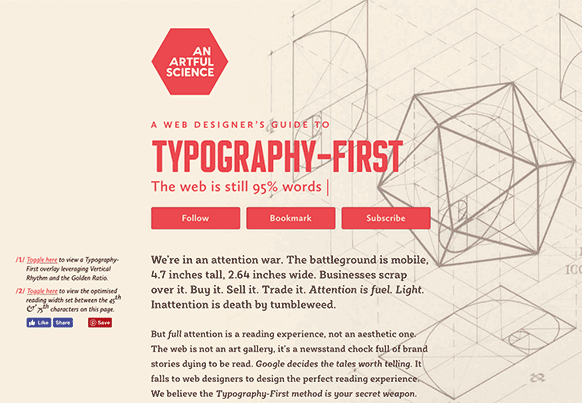

## A Font-ain of Knowledge:  More On...

(_Typography is a **huge** part of the digital arts, and for any field, you should know how to properly use it. If you have some extra time, read and learn more on the creative and proper usage of typography below._)

 
An Artful Science: <a href="https://anartfulscience.com/typography-first.php" target="_blank">Why Typography First?</a>

<h3 id="intro-typography">...An Introduction to Typography</h3>
Explore the examples from C. Knight and J. Glaser in "[Creating Visual Hierarchies](https://www.smashingmagazine.com/2013/02/creating-visual-hierarchies-typography/)"

<h3 id="intro-fonts">...An Introduction to Fonts</h3>
Read the following on serif vs sans-serif fonts:
   - ["The Difference Between Serif And Sans Serif", visual hierarchy](https://visualhierarchy.co/blog/serif-vs-sans-serif/)
   - ["Serif vs. Sans for Text in Print", fonts.com](https://www.fonts.com/content/learning/fontology/level-1/type-anatomy/serif-vs-sans-for-text-in-print)
   -
Explore these additional font combinations:
   - ["Font Pairings: 20 Perfect Examples"](http://www.creativebloq.com/typography/20-perfect-type-pairings-3132120)

<h3 id="emphasis">...Weight, Style, and Size</h3>
Please read the following to get a better sense of how to use absolute and relative font sizes, as well as the differences between the various units.
  - [CSS Font-Sizing: a Definitive Guide](https://www.sitepoint.com/css-font-sizing-tutorial/)
  - [CSS Font-Size: em vs. px vs. pt vs. percent](http://kyleschaeffer.com/development/css-font-size-em-vs-px-vs-pt-vs/)

<h3 id="spacing">...Leading, Kerning, and Word Spacing</h3>
For more information on kerning specifically, read:
  - [Beginner's Guide to Kerning](https://designschool.canva.com/blog/kerning/)

<h3 id="pseudo-classes">...Pseudo-Classes</h3>
There are many more pseudo-classes than these discussed so far. To learn more about pseudo-classes, as well as all that exist, please read this following comprehensive article on CSS pseudo-classes;
  - [An Ultimate Guide To CSS Pseudo-Classes And Pseudo-Elements](https://www.smashingmagazine.com/2016/05/an-ultimate-guide-to-css-pseudo-classes-and-pseudo-elements/)

<h3 id="external-fonts">...Using External Fonts</h3>
For information on what browsers support what types of font formats please read:
  - [Web-Font Formats](https://transfonter.org/formats)
  - [w3schools web font info](https://www.w3schools.com/css/css3_fonts.asp)

<h3 id="sourcing-fonts">...Sourcing Fonts</h3>
Sourcing fonts can have associated pros and cons, too. Read:
  - ["Avoiding Faux Weights And Styles With Google Web Fonts", by Laura Franz]( https://www.smashingmagazine.com/2012/07/avoiding-faux-weights-styles-google-web-fonts/)
