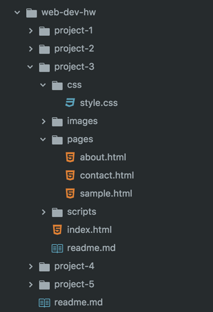

## Topic Homework Assignment:<br/>HW-05: "Typography"


These are the requirements for your homework this Topic. You should go through all of the materials before beginning, so these requirements make sense.


### /web-dev-hw/project-3/
Continue your Project 3 by creating your additional files and directory structure. At a minimum:

1. In Atom, create a new file and save it in `/project-3/pages` as **about.html**
2. Create another new file and save it in `/project-3/pages` as **contact.html**.
3. Create another new file and save it in `/project-3/pages` as **sample.html**.

You should now have _at least_ 4 pages (including your `index.html`) and 1 stylesheet (`/css/style.css`)


#### Fonts
You have three options for using fonts in this Project.
1. Including and linking to external font-package files, as show in the [Download with Google Fonts Example](../get-fonts#google-fonts-download).<br />
**NOTE:** You should add additional directory structure with this method:<br />


2. Importing through the google fonts API, as show in the [Source Google Font Example](../source-fonts#google-fonts-link).<br />
  - In a HTML file, via the **STANDARD** method: <br />
      <div id="code-heading">HTML</div>
      ```html
      <link href="https://fonts.googleapis.com/css?family=Arvo:400,400i,700,700i" rel="stylesheet">
      ```
  - In a CSS file or HTML `<style>...</style>` element, via the **@IMPORT** method: <br />
      <div id="code-heading">CSS</div>
      ```css
      @import url('https://fonts.googleapis.com/css?family=Arvo:400,400i,700,700i');
      ```

3. A combination of both (this will really impress me).

### Structural Linking
In the next section we will be making a decorative menu for your site. At this time, please include a basic list of links to your site pages for grader navitation. It should be in your **index.html** and does not need to be styled.

<div id="code-heading">HTML</div>
```html
<body>
  <!-- This is an example: -->
  <ul id="nav-list">
    <li><a href="./pages/about.html">About</a></li>
    <li><a href="./pages/sample.html">Sample</a></li>
    <li><a href="./pages/contact.html">Contact</a></li>
  </ul>
  <!-- Your site content below: -->
</body>
```


### Style Plan:

Think of your site as a whole or as a "brand." How can you style your pages using typography and color so that they showcase different content, yet apply to the whole? Don't just go dancing about willy-nilly here. Take a minute to consider this, and then explore color and font combintations that apply to your content.

Ask Yourself:
  - Is your site for young readers?<br/> Example: [http://www.nicola-davies.com/](http://www.nicola-davies.com/)
      - Perhaps your theme is "bright" or "fun" or "cute".
      - Your color palette might include pastels or primaries.
      - You might use one highly-decorative font and one highly-legible font for ease-of-read.
  - Is your site for avid news consumers?<br /> Example: [http://time.com/](http://time.com/)
      - Perhaps your theme is "bold" or "stark" or "editorial".
      - Your color palette might be monochoromatic with one high-contrast accent color.
      - You might use one strong serif font and one complimentary sans-serif font for article conent.
  - Is your site for a specific sub-culture or consumer?<br /> Example: [http://therealstanlee.com/](http://therealstanlee.com/)
      - Perhaps your theme is "graphic" or "eye-catching" or "juicy".
      - Your color palette might include a wider analagous or complimentary color palette
      - You might use one cursive or disply font and one highly simplistic, focusing on kerning and spacing.

These are just examples. You should this about this process, and add it to your `readme.md` for the week.


#### Styling Requirments:

After you've written about your **Style Plan** in your readme, begin collecting and builidng your materials. In any way or place you choose, your site needs to include:

##### Typography
**The use of 2 complimentary fonts:**
- These fonts should support the affect of the pages content.
- The fonts should be visually appealing, without distracting from the content.

**Your story should be embellished visually through the use of:**
- emphasized text
- strong text
- colored text

(This means you will need to import all of the appropriate font-family varieties for your body font. Remember: One way of selecting specific words to alter with color, is to wrap them in a `<span>...</span>` element with a unique ID or class name.)

<p id="type-attributes"><b>The use of at least 2 attributes below:</b><br />
You should be purposeful and deliberate in your text setting with the following properties:
  <ul>
    <li>font-size:</li>
    <li>text-align:</li>
    <li>line-height: (Leading)</li>
    <li>letter-spacing: and/or word-spacing: (Kerning)</li>
    <li>font-variant: and/or text-transform:</li>
    <li>text-indent:</li>
    <li>text-decoration:</li>
  </ul>
</p>

##### Color

Begin thinking about the color of your text and the colors of your site.

You should identify and choose a color palette that you will utilize for your page. This color palette should be used to color the:
- background
- headings
- headings background
- emphasized text

You may choose to use a neutral color such as black, dark gray, or light gray (depending on your background color) for the text color itself.


#### Page Structure

##### Title
The title should be styled uniquely from the rest of the content.
  - The title should be visually clear.
  - The styling of the title should help the reader identify it.
  - But the styling of the title should relate to, and complement, the rest of the page.

##### Headings

In addition to a title, your content should be distinguished, separated, and prepared with logical headings and possible sub-headings. As with the page title, these should be:
- Visually clear
- Not detract from the page
- But work with the rest of the content on the page.

##### Body Text

The main text of this document should be easy to read. You can accomplish this by thinking about the points discussed above in CSS Specs.

As mentioned above, you body text should be embellished by marking some of it as strong, emphasized, and using color to further set text apart.


### Content Requirements:

#### `index.html`
Just like in Project 2, your index needs to function as a home page for all of your content, acting primarily act as a hub for all your site's pages. This page needs to include at a minimum:
- A clear site title (heading).
- A "selling feature," like a book summary, written snippet, article heading or list, image, etc. This should draw us into the article/literature/essay/blog that we'll get the full extent of on `sample.html`.
- 2 or more reviews that you _style separately_ (for example, using a `span` or `class` and that changes the font style, color, position, etc to make it stand out).


**NOTE:** You can make these up, but with a little searching, it is quite easy to find introductions and reviews of written work. Again, dust jackets, [Amazon](https://www.amazon.com/books/), [Barns and Nobel](https://www.barnesandnoble.com/), and [Goodreads](https://www.goodreads.com/blog/) are ususally very helpful for this.

<div style="border-top: 5px dotted #1CCDCA; width: 100%; margin-top: 150px"></div>
<div style="border-top: 5px dotted #1CCDCA; width: 100%; margin-top: 20px"></div>


#### `sample.html`
This page should carry the bulk of your content, and needs to include the full piece or sample portion from a written work. This page needs to include at a minimum:
- A clear title (heading) and body.
- 2 complimentary fonts.
- You must use at least one "pseudo-element":
  <div id="code-heading">CSS</div>
  ```css
  ::first-letter {}
  ::first-line {}
  ```
- You must use at least one "pseudo-class".
  <div id="code-heading">CSS</div>
  ```css
    ::hover {}
    ::active {}
  ```

When it comes to `pseudo-class`es, you have more options you can [explore on your own](https://www.smashingmagazine.com/2016/05/an-ultimate-guide-to-css-pseudo-classes-and-pseudo-elements/). A possible use of a `pseudo-class` is with a **"read more"** or **"pre-order"** / **"purchase here"** button if you need an idea, but you can fulfill this requirement any way you want.


<div style="border-top: 5px dotted #1CCDCA; width: 100%; margin-top: 150px"></div>
<div style="border-top: 5px dotted #1CCDCA; width: 100%; margin-top: 20px"></div>


#### `about.html`
This area needs to be about the writer, be it you or the cited author. You may source all this material, as long as you cite it below your content. This page needs to include at a minimum:
- A paragraph about the author.
- A quote or fun fact that you _style separately_.
- A related image.

<div style="border-top: 5px dotted #1CCDCA; width: 100%; margin-top: 150px"></div>
<div style="border-top: 5px dotted #1CCDCA; width: 100%; margin-top: 20px"></div>


#### `contact.html`
You need to include a simple contact page, where a reader can contact either you, a publisher, the author themselves, or whomever. Try finding a legitimate contact (say Scholastic), or create a false entity. Create a form that inlcudes at a minimum:
- A name input.
- An e-mail input.
- A text box to add comments/questions/ect.
- A submit button.


### `readme.md`
Continue documenting your learning progress in your Project 2 Readme as you go along. This week, please include a short paragraph about your theme+color+font choices, and why you selected them.


# { TODO: }
1. Use the previous pages of the Topic to complete you homework assignment.
2. Finish documenting your Project's progress in your `README.md`!
