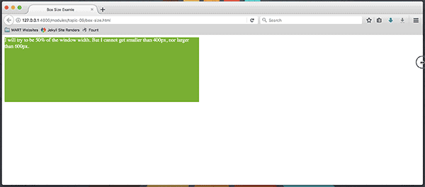

## Box Size:

With CSS and HTML, you may think of elements as boxes. Webpages, therefore, are made up of boxes; inside boxes, next to boxes, inside more boxes.

The website you are looking at now is just a collection of organized boxes. You can see the header, the wide box at the top that holds the Media Arts Logo, and either week modules as tabs, or a "hamburger menu" where you can access those modules. Each module tab, the accent bar, and the logo, are each sub-boxes inside the header box.

So, it is important that you learn how to control the size, positioning, and placement of the boxes on your sites.

### Width & Height

There are a number of ways to control the size of boxes. The first two properties you will get to know, are aptly named `width: ` and `height: `.

As with properties effecting typography, there are ways of setting the size of boxes using both absolute and relative measurement values.

#### Pixels

The advantage of 'hard-coding' the size of elements to absolute values using pixels, is that you know exactly how the site will look. The relationships of elements to each other will stay the same, and never change. Of course, this may lose impact if the screen size of the viewer's device is not large enough to see all of the content, and they are forced to awkwardly scroll around.

This may also get slightly askew when your user increases or decreases the font size of page which will cause the boxes to increase/decrease as well.

That being said, there are times when using pixels is appropriate.

  

  

  

    

    

      

          <h2>Inner Box</h2>
          
Notice, that this box is smaller than its 'parent-container'.

      

      <h2>Outer Box</h2>
      
Notice, I am larger than the 'inner-box'.

    

  

#### Percentages

Another way of specifying size of boxes is through percentages. Percentages work by being the percent specified of the _parent_ element.

If the parent element is `<body>...</body>` then the elements width can be set using a percentage, and it will stay in relation to the size of the page. However, the height must be set using an absolute value still.

In the following example, the parent-container or outer-box is set to be 66% the width of the window or parent example container in this example. There is no height property given. So instead, it is made tall enough by the browser to hold its content.

The 'inner-box' is set to be 75% of the width, and 50% of the height of the 'parent-container.'

**NOTE:** Change the width of your browser window and notice the ability of the example to resize accordingly.

  

  

    

    

      

          <h2>Inner Box</h2>
          
This box is always 75% of the width and 50% of the height of the 'parent-container'.

      

      <h2>Outer Box</h2>
      
This box is 66% of the width of the window (or example box container...) and it is as tall as is needed to hold the inner content.

    

  

Now that our boxes can resize in relation to the screen, we will have to be careful about setting absolute sizes. The following is the same example as the previous _EXCEPT_ the height of the 'parent-container' is set to 300p pixels. There is also more text. Notice, that when you make your browser window narrow, the text spills out of the element. This is plain example of bad web design.

  

  

    

    

      

          <h2>Inner Box</h2>
          
This box is always 75% of the width and 50% of the height of the 'parent-container'.

      

      <h2>Outer Box</h2>
      
This box is 66% of the width of the window (or example box container...) and it is set top be 300 pixels tall.

      
Unfortunatly, when the browser is narrow, there is not enough room in the box for all of this extra text, so it will run outside of the box.

    

  

### Min & Max - Width/Height

There are a few ways of ensuring our boxes are sized appropriately for the contained content. One is to set min and max sizes for both width and height.

#### Min

Setting the `min-width: ` and/or `min-height: ` properties ensures a content box will never be too small.

#### Max

Likewise, setting the `max-width: ` and/or `max-height: ` properties ensures that a box that is intended to display a small amount of information ever gets too big.

### An Example

  

  

    
    

      I will try to be 50% of the window width. But I cannot get smaller than 400px, nor larger than 600px.
    

  

#### Testing
When thinking about adaptive sizing, you should always test by - you guessed it - resizing your browser to see how your layout performs. Start by manipulating your window:

Your layout may also be affected by text size. If you think the size of your text is totally in your control, you are 100% wrong. Most browsers allow for user zooming as an accessibility feature. Try zooming in to see how this affects the contents:

  - For Mac:
    <kbd class="keyboard-key nowrap" style="border: 3px outset #F3F3F3; border-left-color: #DBDBDB; border-top-color: #DBDBDB; background-color: #F3F3F3; padding: 0px 2px; font-family: inherit; font-size: 0.85em; color: black">
    ⌘ Cmd</kbd>
    and
    <kbd class="keyboard-key nowrap" style="border: 3px outset #F3F3F3; border-left-color: #DBDBDB; border-top-color: #DBDBDB; background-color: #F3F3F3; padding: 0px 2px; font-family: inherit; font-size: 0.85em; color: black">+</kbd>
    or
    <kbd class="keyboard-key nowrap" style="border: 3px outset #F3F3F3; border-left-color: #DBDBDB; border-top-color: #DBDBDB; background-color: #F3F3F3; padding: 0px 2px; font-family: inherit; font-size: 0.85em; color: black">-</kbd>

  - For PC:
    <kbd class="keyboard-key nowrap" style="border: 3px outset #F3F3F3; border-left-color: #DBDBDB; border-top-color: #DBDBDB; background-color: #F3F3F3; padding: 0px 2px; font-family: inherit; font-size: 0.85em; color: black">Ctrl</kbd>
    and
    <kbd class="keyboard-key nowrap" style="border: 3px outset #F3F3F3; border-left-color: #DBDBDB; border-top-color: #DBDBDB; background-color: #F3F3F3; padding: 0px 2px; font-family: inherit; font-size: 0.85em; color: black">+</kbd>
    or
    <kbd class="keyboard-key nowrap" style="border: 3px outset #F3F3F3; border-left-color: #DBDBDB; border-top-color: #DBDBDB; background-color: #F3F3F3; padding: 0px 2px; font-family: inherit; font-size: 0.85em; color: black">-</kbd>

# { TODO: }
1. <a href="{{site.baseurl}}/modules/topic-09/box-size.html" target="_blank">Open the example in a separate tab</a> and resize the window to observe the difference.
2. Read pages 300-305 of Chapter 13 in [Duckett](https://github.com/Media-Ed-Online/intro-web-dev/issues/3).
