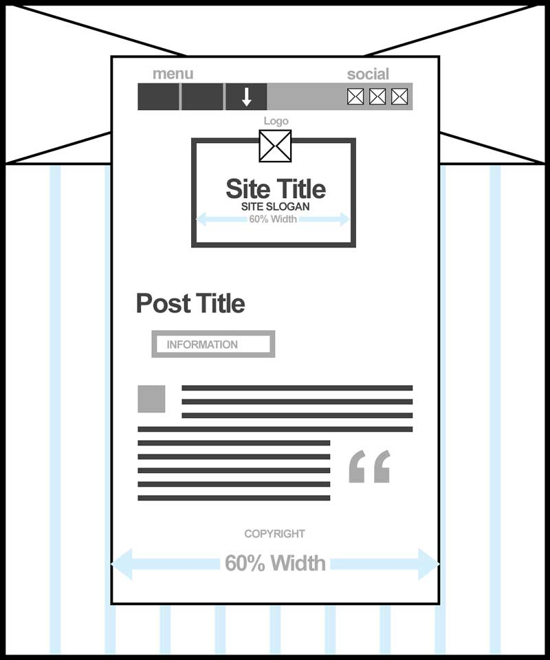

# Justine Evans

## Project 3

My project will be a blog site about baking, and feature cool CSS like:

- a dropdown set of menu items
- a logo image which changes on hover
- pull quotes
- a button

---

### Colors

There will be 4 primary colors:
<ul style="color: #FFF;">
  <li style="background-color: lightblue"> &nbsp;lightblue</li>
  <li style="background-color: salmon">  &nbsp;salmon</li>
  <li style="background-color: chocolate"> &nbsp;chocolate</li>
  <li style="background-color: saddlebrown"> &nbsp;saddlebrown</li>
</ul>

And shades:
<ul style="color: #444;">
  <li style="border: 1px solid #000"> &nbsp;#FFF</li>
  <li style="background-color: #999"> &nbsp;#999</li>
  <li style="background-color: #666">  &nbsp;#666</li>
  <li style="background-color: #000"> &nbsp;#000</li>
</ul>

---

### Fonts

#### Faces

For headings, I will use [_**Pacifico**_](https://fonts.google.com/specimen/Pacifico), which is a _"fun brush script handwriting font...which was inspired by the 1950s American surf culture in 2011."_ Perfect for a curvy but crisp blog like this.

For body content, I'm liking [_**Arvo**_](https://fonts.google.com/specimen/Arvo). It's a bit unorthodox to have a cursive and serfic font pairing, but Arvo's _"geometric slab-serif typeface family [is] nearly monolinear to increase legibility,"_ so I think it'll be fine.

#### Sizes

- Extra Large: 3em (48px); site information
- Large: 2em (32px); pull-quotes, :first-letter
- Regular: 1em (16px); body content
- Small: .75em (12px); copywrite exclusively

---

### Layout

I will utilize a basic one-page site layout with fixed background elements, a header with menu and site information, and a central column for the blog post:

